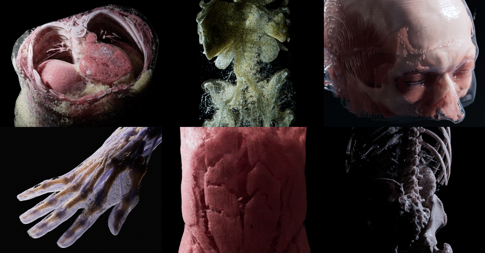
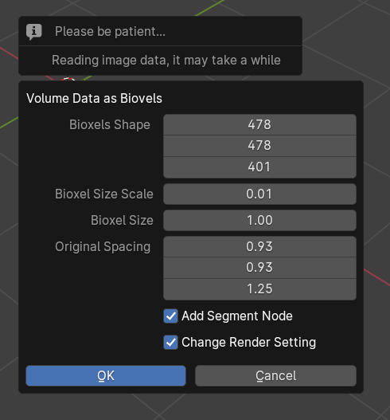

[中文文档](https://uj6xfhbzp0.feishu.cn/wiki/Qx3VwHuNPimeI8kr6nDcvl1DnHf?from=from_copylink)

# Bioxel Nodes

Bioxel Nodes is a Blender add-on for scientific volumetric data visualization. It using Blender's powerful Geometry Nodes | Cycles to process and render volumetric data.

Before us, there have been many tutorials and add-ons for importing volumetric data into Blender. However, we found that there were many details that were not addressed in place, some scientific facts were ignored, and the volume rendering was not pretty enough. With Bioxel Nodes, you can easily import the volumetric data into Blender, and more importantly, it can quickly make a beautiful realistic rendering of it.

Below are some examples with BioxelNodes. Thanks to Cycles Render, the volumetric data can be rendered with great detail:

# Getting Started

Currently only support Blender 4.1 or above, make sure you have the correct version of Blender.

### Add-on Installation

Download the latest version https://github.com/OmooLab/BioxelNodes/releases/latest  
In Blender, `Edit - Preferences - Add-ons - Install`, select the `BioxelNodes_{version}.zip` you just downloaded.

### Dependency Installation

The add-on requires a third-party python dependency called SimpleITK, click the Install SimpleITK button below to install the dependency. After clicking, blender may get stuck, it is downloading and installing, just wait for a moment. After the Installation, **restart blender once**.

This step may have failed due to network factors, just click "Set PyPI Mirror" to change the mirror.

### Basic Usage

First you need to have your volumetric data ready. If not, you can access open research data from [Dryad](https://datadryad.org) (Dryad publishes data exclusively under a [Creative Commons Public Domain License](https://creativecommons.org/public-domain/cc0/))

Note: Make sure one folder contains only one sequence, multiple sequences need to be manually split into different folders first.

In Blender, `File - Import - Volume Data as Biovels`, select **one** of the .dcm files and click on "Volume Data as Bioxels" (you can also drag one of the .dcm files directly into the 3D viewport to trigger the import, but this is limited to .dcm format files)

It may take a while to read data. After finishing reading, it will pop up a dialog box

Ignore the options, just click OK!

After importing, the necessary nodes are automatically added, the reconstruction and shader are created, and then turned on the cycles rendering to directly see the result.

Click select Bioxels Object, and open the Geometry Nodes panel to see the following node graph:

You can change the "Threshold" to modify the reconstruction model, or change the "Color", "Density" to modify the shader effect. All the parameters are straightforward, you can understand them by changing the values.

The node, that named "Segment", is a preset node that combines the steps of 3D reconstruction process and shading process. In general, you need to add one of the segmentation node to reconstruction first, and followed by one of the shader node to set the shader. As you can see in the following figure:

Currently there are 3 types of nodes

- Segmentation nodes, responsible for splitting the volume into a reconstructed model (we call them "Segment").
- Shader nodes, responsible for giving shader to the Segment.
- Slicer nodes, responsible for partially cutting the Segment.

For example:

You can add a "Bake" node between segmentation node and shader node, if the reconstruction process consumes too much computing time. But be sure, you are selecting the volume object, not the container object.

# Known limitations

- Cannot read DICOM with multiple series.
- Sections cannot be generated
- Only sequence files are supported, packed volume data formats are not supported yet (will be supported soon)

# Future Features

- Support more volumetric data formats (.nii, .map, .txm...)
- Generate sections
- More segmentation methods, e.g. AI segmentation.
- Even better shader for volumetric rendering

# Technical Notes

The "Bioxel" in "BioxelNodes", is a combination of the words "Bio-" and "Voxel". Bioxel is a voxel that stores biological data, so maybe its chinese name should be "生素" 😂? The volumetric data made up of Bioxel is called Bioxels. We are developing a toolkit around Bioxels for better biological data visualization. but before its release, we made this Blender version of bioxels toolkit first, in order to let more people to have fun with volumetric data. Because we have been pursuing one thing:
**Science that can be beautiful at the same time.**

### Bioxels

Bioxels is based on the RAS coordinate system, Right Aanterior Superior, which was chosen over LPS because it is more compatible with most 3D CG software coordinate systems, and is in line with the 3D artist's understanding of space.

All distances within Bioxels are in Units, and are specified in Meter pre unit. However, when Bioxels is imported into 3D CG software, its size in the software is not scaled by reading the Meter pre unit directly. The reason for this is that many 3D operations in software require that the primtives not be too large or too small.

### Based on OpenVDB

Bioxels is based entirely on OpenVDB for storage and rendering. The main reason for choosing OpenVDB is that as a volumetric data format, it is the fastest way to work with most CG renderers.

### Based on Geometry Nodes

Bioxel Nodes relies on Blender Geometry Nodes to reconstruct and render volumetric data. Node-based operations ensure that the original data is not permanently altered during reconstruction and rendering operations. The fact that the processing is based on Geometry Nodes without any additional dependencies also ensures that Blender can open files without this plugin installed. Look for more support for OpenVDB in GeometryNodes so that BioxelNodes can do more in the future.
