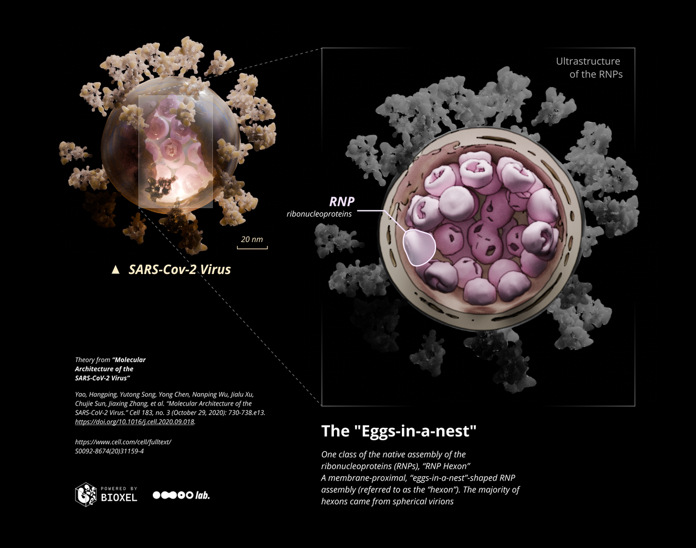
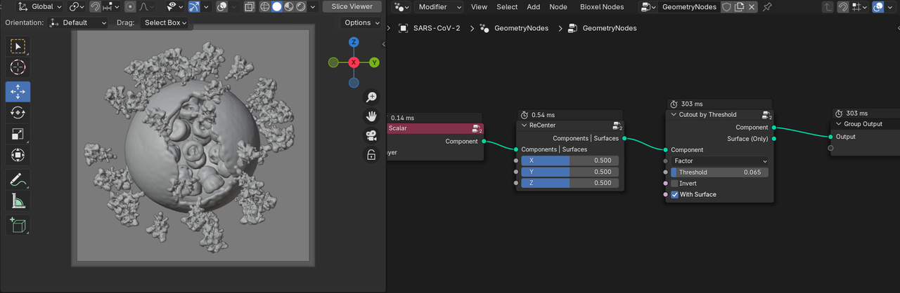
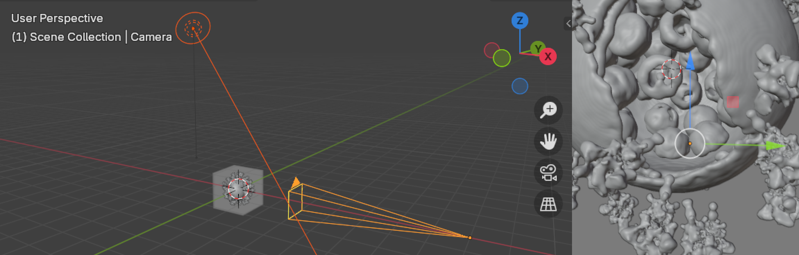
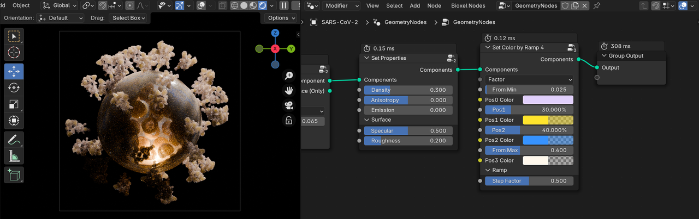
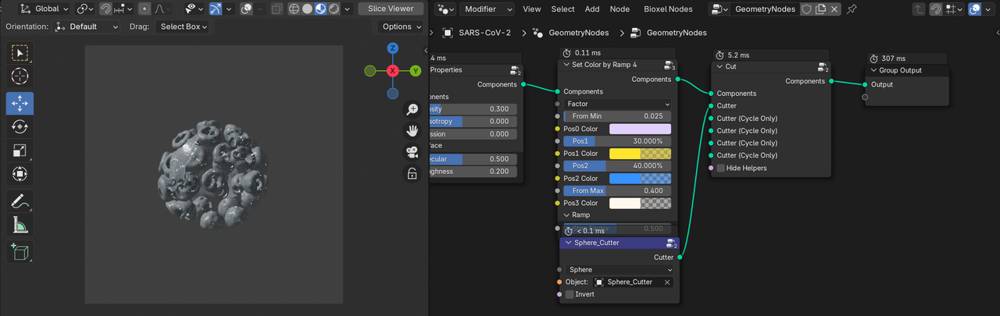
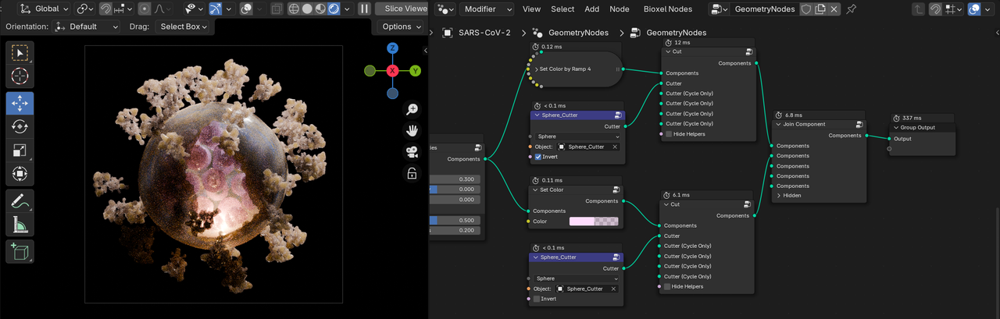
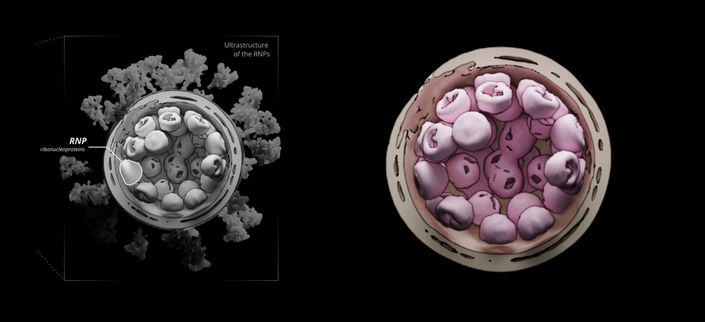
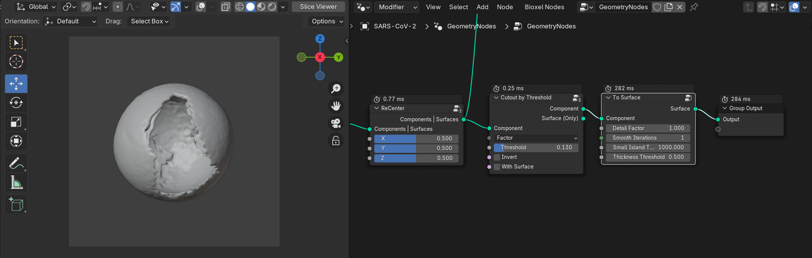
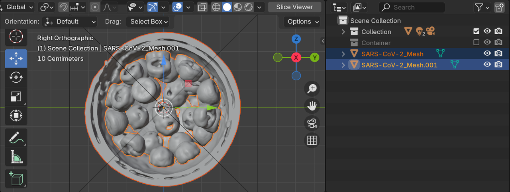
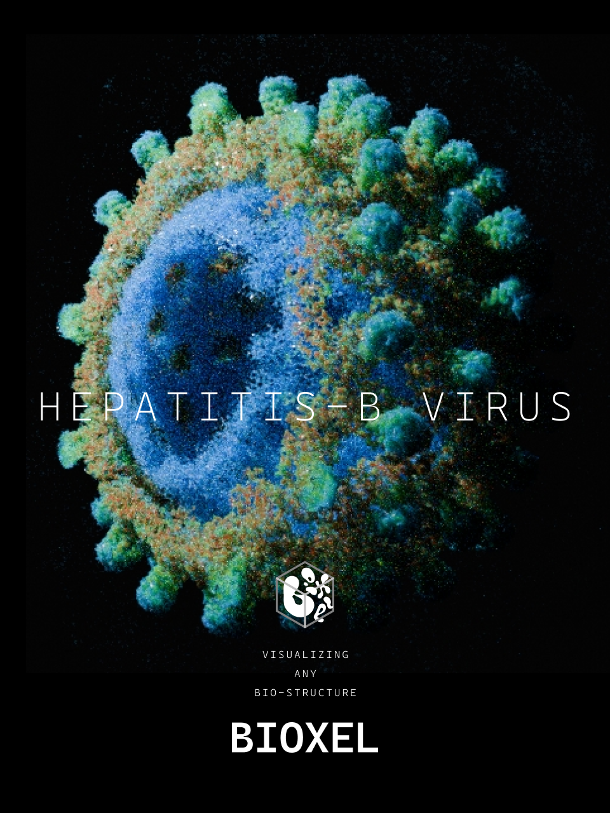

# SARS-Cov-2

In this tutorial, we'll make a structural visualzation of the SARS-Cov-2 Virus. Please see [step by step](step_by_step.md) to make sure you have a basic understanding of how to use the addon, and make sure the addon version is v1.0.2 or higher!

Research data is from paper published in September 2020 in Cell Press ([https://www.cell.com/cell/fulltext/S0092-8674(20)31159-4](<https://www.cell.com/cell/fulltext/S0092-8674(20)31159-4>)) by Li Sai team at Tsinghua University. This research revealed the molecular assembly of the authentic SARS-CoV-2 virus using cryoelectron tomography (cryo-ET) and subtomogram averaging (STA). Here is an official video of this study

<iframe width="560" height="315" src="https://www.youtube.com/embed/JSKl5VY4k5w?si=t4LhrCRebxrX_Saf&amp;controls=0" title="YouTube video player" frameborder="0" allow="accelerometer; autoplay; clipboard-write; encrypted-media; gyroscope; picture-in-picture; web-share" referrerpolicy="strict-origin-when-cross-origin" allowfullscreen></iframe>

"It remains enigmatic how coronaviruses pack the ∼30-kb RNA into the ∼80-nm-diameter viral lumen. Are the RNPs ordered relative to each other to avoid RNA entangling, knotting, or even damage or are they involved in virus assembly?" Three assembly classes were proposed in the paper, we will make a visualzation of the "eggs-in-a-nest"-shaped RNPs assembly, based on real cryo-ET data.

## Download and import data

The data of this research is hosted on EMDB ([https://www.ebi.ac.uk/emdb](https://www.ebi.ac.uk/emdb)), and the website of SARS-Cov-2 virus is [here](https://www.ebi.ac.uk/emdb/EMD-30430). Open the page, find "Download" button and select the first selection "3D Volume (.map.gz)".

In case you can't download data, you can download here.

[SARS-Cov-2.map](https://drive.google.com/file/d/1LMybsmTVbwQ38_eqAx6hbZTc5p2fdcjK/view?usp=sharing)

After downloading, put it into any directory and import the data. In the import options, it is recommended to adjust the Bioxel Size to 5, in order to reduce the shape of the data to increase the speed of calculation and rendering. If you are confident in the performance of your hardware, you can leave the original 2.72 unchanged. After adjusting the Bioxel Size, the shape of the converted data will be calculated below based on the current bioxel size. The amount of data will increase exponentially with larger shape, and may result in OOM (out of memory).

## Cutout the Virus

After importing, you can get the virus by creating and connecting nodes and setting parameters as shown below

Place the light and the camera in the way as below. The backlight is a area light, color white, intensity 500W, spread 90°, and inside the virus, place a point light, color `FFD08D`, intensity 5W. Camera focal length is 200 mm. the background color is pure black. The Look of the color management is High Contrast.

Continue editing the node, followed by "Set Properies" and "Set Color by Ramp 4" node, the parameters of these two nodes are set as shown in the figure, where the color part, from top to bottom, is set to `E1D0FC` (1.0), `FFE42D` (0.5), `3793FF` (0.5), `FFFF8EC` (0.1) (alpha value in parentheses). Color alpha also affects density.

If you feel that rendering is too slow, see [here](improve_performance.md) for suggestions

## Color the RNPs alone

The current rendering is pretty good, but considering that my goal is to make it clear how the RNPs are arranged within the virus, the RNPs should be colored differently than the others. So how to color the RNPs alone?

First of all, we have to separate the RNPs. The value of RNPs is between the membrane and S protein, so it is very difficult to separate. The good thing is that the virus is spherical, we can separate the RNPs part of the virus from the rest by using a sphere cutter. To do so, in the Geometry Nodes panel menu of the container, click **Bioxel Nodes > Add a Cutter > Sphere Cutter**, and adjust the scale and position of the newly created sphere object named "Sphere_Cutter" appropriately, so that it can just separate the internal RNPs and membrane of the virus.

The process of changing the position of the "Sphere_Cutter" object can be very laggy, then you can turn off "With Surface" and do it in Slice Viewer mode. Once you are happy with it, you can restore the settings.

Then we turn on Invert in the "Sphere Cutter" node and you can see the opposite result. This way we've managed to separate the two, next let's color them separately and finally merge them with Join Component. Create and join the nodes as shown below, where the second Cutter node is copied and the color value in Set Color is `FFDDFE` (0.5). If all is well, the rendering should look like below.

At this point, the rendering of a SARS-Cov-2 virus is complete!

## Render RNPs and Membranes

Realistic rendering is great, but Non-photorealistic rendering (NPR) is better for presenting structural information. So I will render ultrastructure of the RNPs assembly with toon shader.

The silhouettes of RNPs uses Blender's Line Art feature, but Line Art must be based on a mesh. Select the nodes that are extruding the RNPs (i.e., the "Cut" nodes that are in charge of cutting out the RNPs), and right-click, click **Bioxel Nodes > Extract Mesh**. This gives you a new mesh object of the RNPs.

Extract the membrane mesh in the same way.

The membrane has a much higher value than the rest of the virus, so let's create a new "Cutout" node, also after the ReCenter, but with the threshold adjusted to 0.13. After the Cutout, connect to the "To Surface" node and parameterize it as shown in the figure, noting that the Remove Island Threshold is set to 1000 so that any fragments smaller than 1000 pts be eliminated. Then select the "To Surface" node, and perform the operation of extracting the mesh.

The mesh of the membrane needs to be cut in half, this can be done with the Box Trim brush in sculpt mode or with the Boolean modifier. the mesh of the RNPs may also need some repair work, I cleaned up some of the broken surfaces of the RNPs. all the meshes are now ready to be used.

For Line Art, please see the video tutorial from Blender Secrets.

<iframe width="560" height="315" src="https://www.youtube.com/embed/aIWdBq7-ias?si=CrcStx5VVJBwDpzu&amp;controls=0" title="YouTube video player" frameborder="0" allow="accelerometer; autoplay; clipboard-write; encrypted-media; gyroscope; picture-in-picture; web-share" referrerpolicy="strict-origin-when-cross-origin" allowfullscreen></iframe>

Finally, an infographic on the ultrastructure of RNPs is done!

If you have trouble following the docs, you can download the project files.

[SARS-Cov-2.zip](https://drive.google.com/file/d/15GpIoIjVAE-Jr98zWo7oupuk1KfRVPmk/view?usp=sharing)

## Homework

Other data relevant to the study are provided in the paper, you could try visualizing them.

Go to the official EMDB website https://www.ebi.ac.uk/emdb/ and enter the EMD number in the search box to get them.

The Electron Microscopy Data Bank (EMDB) is a public repository for cryogenic-sample Electron Microscopy (cryoEM) volumes and representative tomograms of macromolecular complexes and subcellular structures. If you want to get data on other virus, just enter their name in the search box. For example, hepatitis B virus, enter it into the search box, then select Virus in the Sample Type on the left side, and download the data you need (it is better to find the corresponding paper to clarify the data information).

**Try to visualize hepatitis B virus.**

