# SARS-Cov-2

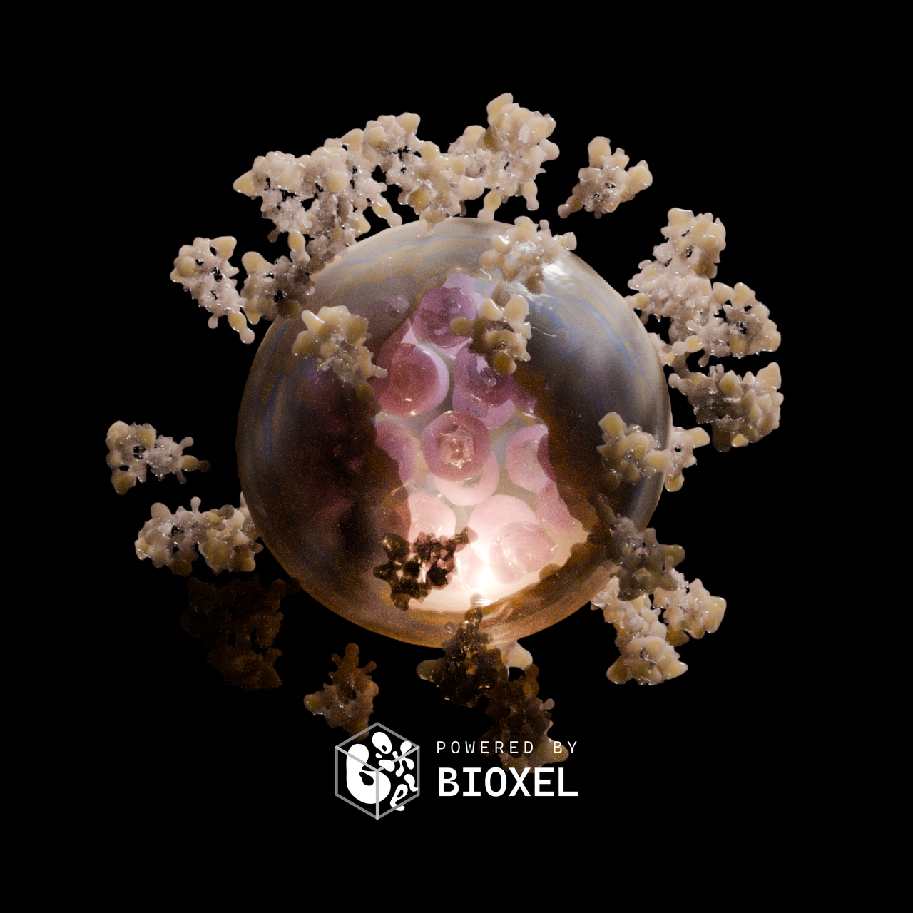

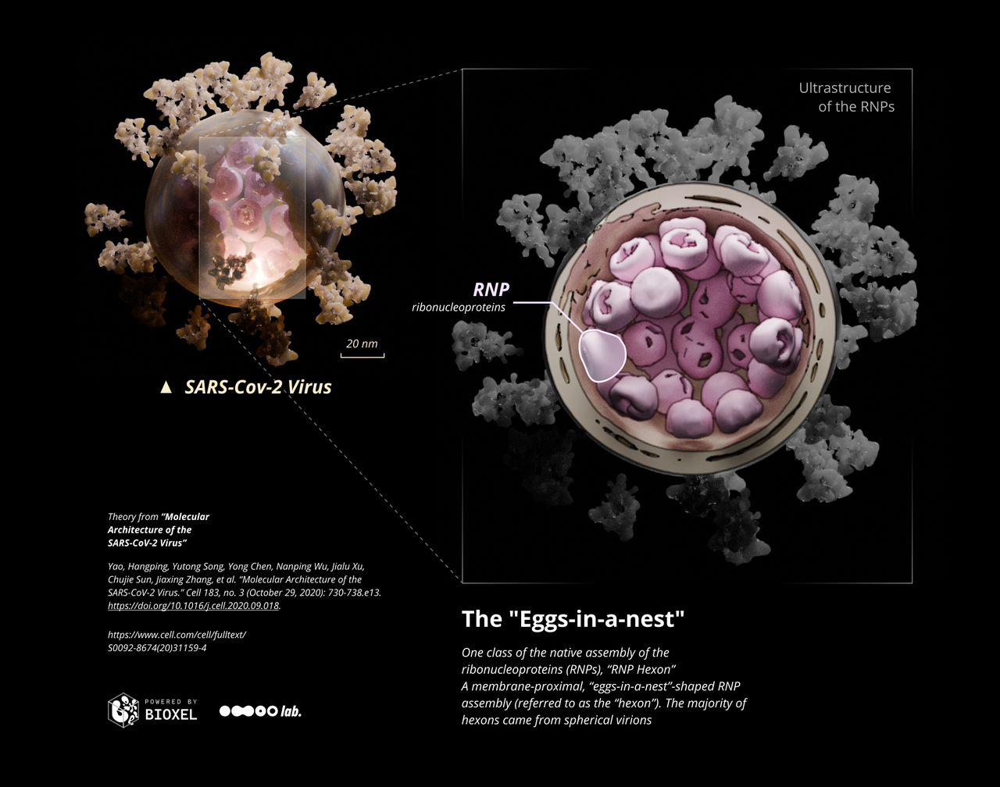

在本教程中，我们将制作 SARS-Cov-2 病毒的结构可视化。请确保您已阅读[分步指南](step_by_step.md)以了解插件的基本使用方法，并确保插件版本为 v1.0.2 或更高！

研究数据来自 2020 年 9 月发表在 Cell Press 的论文（[https://www.cell.com/cell/fulltext/S0092-8674(20)31159-4](<https://www.cell.com/cell/fulltext/S0092-8674(20)31159-4>)），作者是清华大学李赛团队。该研究使用冷冻电子断层扫描（cryo-ET）和亚断层图平均（STA）揭示了真实 SARS-CoV-2 病毒的分子组装。以下是该研究的官方视频：

<iframe width="560" height="315" src="https://www.youtube.com/embed/JSKl5VY4k5w?si=t4LhrCRebxrX_Saf&amp;controls=0" title="YouTube video player" frameborder="0" allow="accelerometer; autoplay; clipboard-write; encrypted-media; gyroscope; picture-in-picture; web-share" referrerpolicy="strict-origin-when-cross-origin" allowfullscreen></iframe>

"冠状病毒如何将约 30kb 的 RNA 包装到约 80nm 直径的病毒腔内仍然是个谜。RNP 彼此之间是否有序以避免 RNA 缠结、打结或损坏，还是它们参与病毒组装？" 论文中提出了三类组装方式，我们将基于真实的冷冻电镜数据，制作"巢中蛋"形 RNP 组装的可视化。

## 下载和导入数据

该研究的数据托管在 EMDB（[https://www.ebi.ac.uk/emdb](https://www.ebi.ac.uk/emdb)），SARS-Cov-2 病毒网站是[这里](https://www.ebi.ac.uk/emdb/EMD-30430)。打开页面，找到"Download"按钮，选择第一个选项"3D Volume (.map.gz)"。

如果您无法下载数据，可以从这里下载。

[SARS-Cov-2.map](https://drive.google.com/file/d/1LMybsmTVbwQ38_eqAx6hbZTc5p2fdcjK/view?usp=sharing)

下载后，放到任意目录并导入数据。在导入选项中，建议将 Bioxel Size 调整为 5，以减小数据形状，提高计算和渲染速度。如果您对硬件性能有信心，可以保持原始的 2.72 不变。调整 Bioxel Size 后，下方会根据当前的 bioxel size 计算转换后数据的形状。数据量会随着形状增大呈指数增长，可能会导致内存不足（OOM）。

## 切割病毒

导入后，您可以通过创建和连接节点并设置参数来获取病毒，如下图所示。

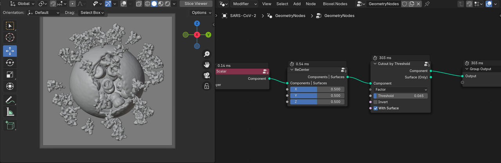

按下图所示放置灯光和相机。背光是区域光，白色，强度 500W，扩散 90°；在病毒内部放置一个点光源，颜色 `FFD08D`，强度 5W。相机焦距为 200mm。背景颜色为纯黑色。颜色管理的 Look 为 High Contrast。

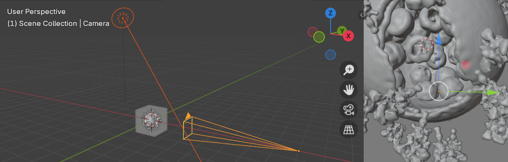

继续编辑节点，接着是"Set Properties"和"Set Color by Ramp 4"节点，这两个节点的参数设置如下图，其中颜色部分，从上到下设置为 `E1D0FC`（1.0）、`FFE42D`（0.5）、`3793FF`（0.5）、`FFFF8EC`（0.1）（括号中为 alpha 值）。颜色的 alpha 值也会影响密度。

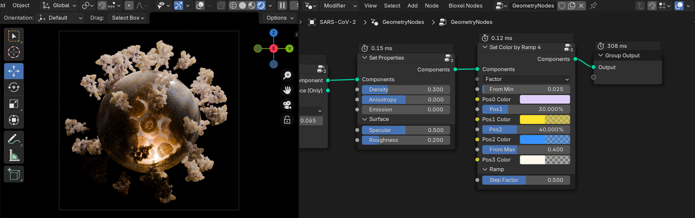

如果您觉得渲染太慢，请参阅[这里](improve_performance.md)获取建议。

## 单独为 RNP 着色

当前的渲染效果很好，但考虑到我的目标是让您清楚看到 RNP 在病毒内部的排列方式，RNP 应该与其他部分用不同颜色着色。那么如何单独为 RNP 着色呢？

首先，我们必须分离 RNP。RNP 的值介于膜和 S 蛋白之间，因此很难分离。好在病毒是球形的，我们可以使用球形切割器将病毒的 RNP 部分与其余部分分离。为此，在容器的几何节点面板菜单中，点击 **Bioxel Nodes > Add a Cutter > Sphere Cutter**，并适当调整新创建的名为"Sphere_Cutter"的球体对象的大小和位置，使其恰好能将病毒内部的 RNP 和膜分离。

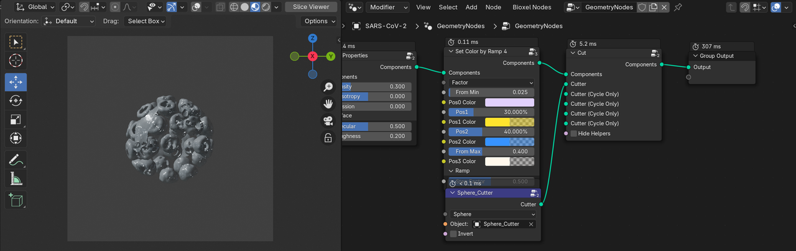

改变"Sphere_Cutter"对象的位置可能会非常卡顿，此时您可以关闭"With Surface"并在 Slice Viewer 模式下操作。满意后，恢复设置。

然后在"Sphere Cutter"节点中打开 Invert，您可以看到相反的结果。这样我们就成功将两者分离了。接下来让我们分别着色，最后用 Join Component 合并。按如下图所示创建和连接节点，其中第二个 Cutter 节点是复制的，Set Color 中的颜色值设置为 `FFDDFE`（0.5）。如果一切正常，渲染结果应该如下图所示。

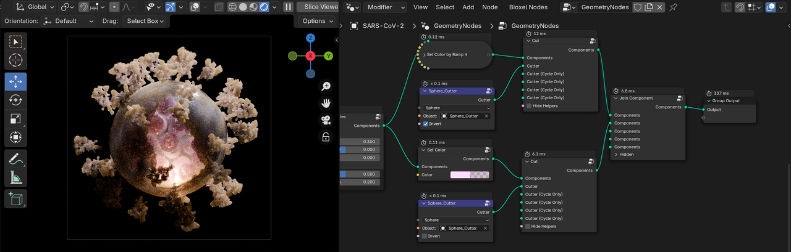

此时，SARS-Cov-2 病毒的渲染完成了！

## 渲染 RNP 和膜

写实渲染很棒，但非写实渲染（NPR）在呈现结构信息方面更好。因此，我将使用卡通着色器来渲染 RNP 组装的首尾结构。

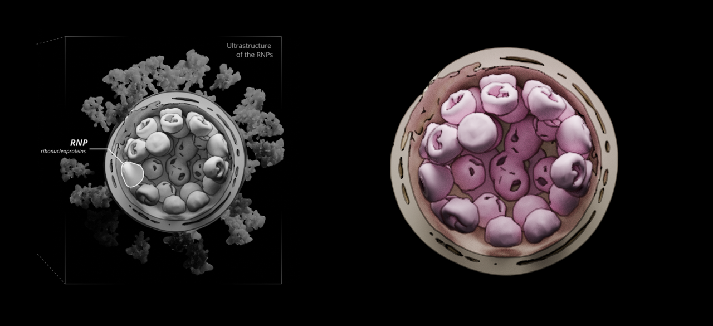

RNP 的轮廓使用 Blender 的线稿（Line Art）功能，但线稿必须基于网格。选择挤出 RNP 的节点（即负责切割出 RNP 的"Cut"节点），右键点击 **Bioxel Nodes > Extract Mesh**。这将为您创建一个 RNP 的新网格对象。

用同样的方式提取膜网格。

膜的病毒值远高于其他部分，因此让我们创建一个新的"Cutout"节点，同样在 ReCenter 之后，但阈值调整为 0.13。Cutout 后，连接到"To Surface"节点并按如下图所示设置参数，注意 Remove Island Threshold 设置为 1000，以便消除小于 1000 pts 的任何碎片。然后选择"To Surface"节点，执行提取网格的操作。

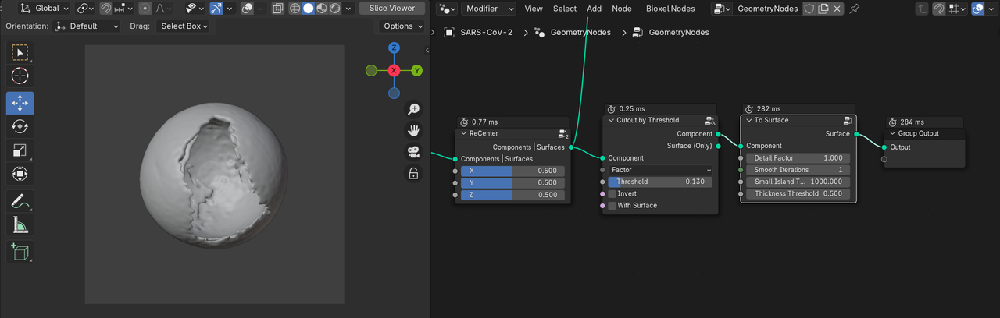

膜的网格需要切成两半，这可以通过雕刻模式中的 Box Trim 笔刷或布尔修改器来完成。RNP 的网格也可能需要一些修复工作，我清理了一些 RNP 的破损表面。所有网格现在都可以使用了。

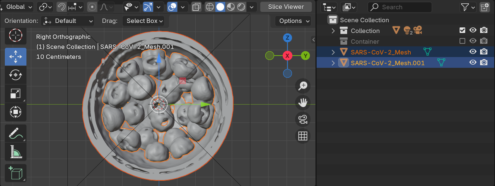

关于线稿，请参阅 Blender Secrets 的视频教程。

<iframe width="560" height="315" src="https://www.youtube.com/embed/aIWdBq7-ias?si=CrcStx5VVJBwDpzu&amp;controls=0" title="YouTube video player" frameborder="0" allow="accelerometer; autoplay; clipboard-write; encrypted-media; gyroscope; picture-in-picture; web-share" referrerpolicy="strict-origin-when-cross-origin" allowfullscreen></iframe>

最后，RNP 超微结构的信息图完成了！

如果您按照文档有困难，可以下载项目文件。

[SARS-Cov-2.zip](https://drive.google.com/file/d/15GpIoIjVAE-Jr98zWo7oupuk1KfRVPmk/view?usp=sharing)

## 作业

论文中提供了其他相关数据，您可以尝试可视化它们。

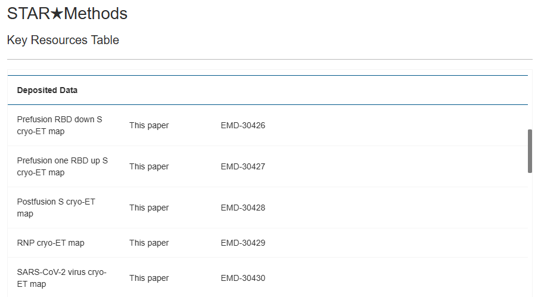

前往官方 EMDB 网站 https://www.ebi.ac.uk/emdb/，在搜索框中输入 EMD 编号即可获取。

电子显微镜数据银行（EMDB）是一个公共仓库，用于存放冷冻样品的电子显微镜（cryoEM）体积和代表性断层图。如果您想获取其他病毒的数据，只需在搜索框中输入其名称即可。例如，乙型肝炎病毒，在搜索框中输入，然后选择左侧 Sample Type 中的 Virus，下载您需要的数据（最好找到相应的论文来明确数据信息）。

**尝试可视化乙型肝炎病毒。**

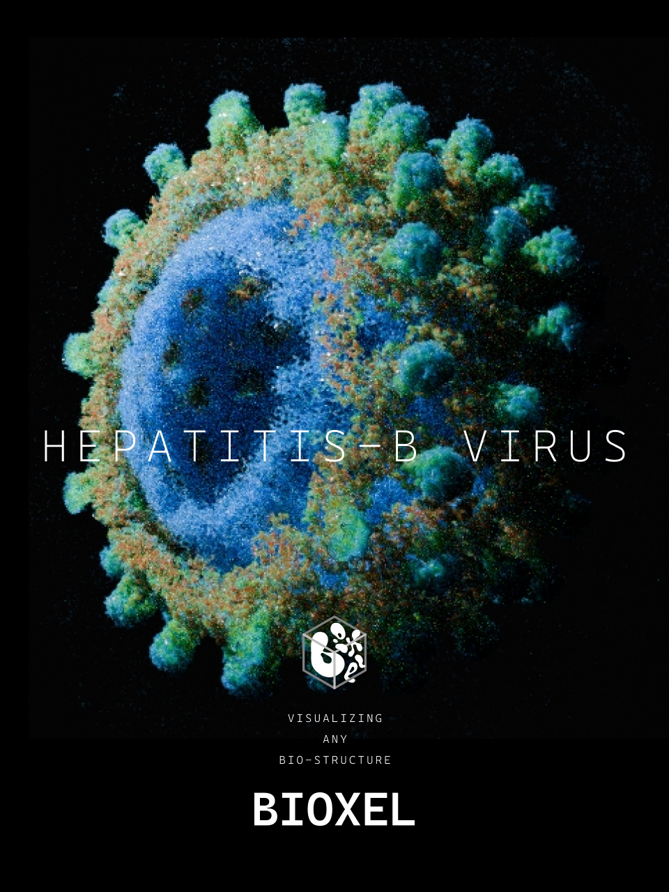