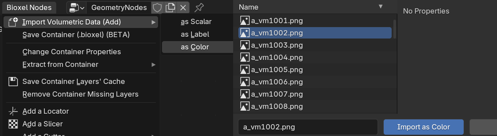
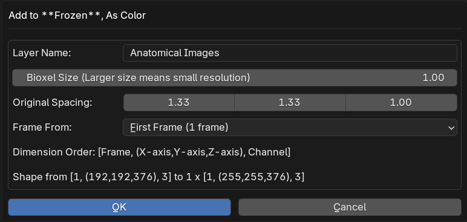
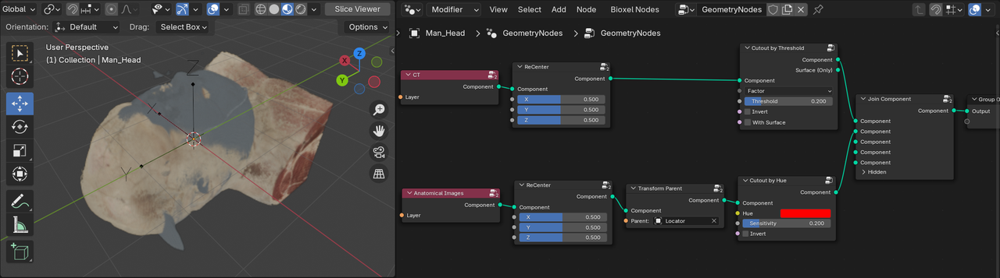
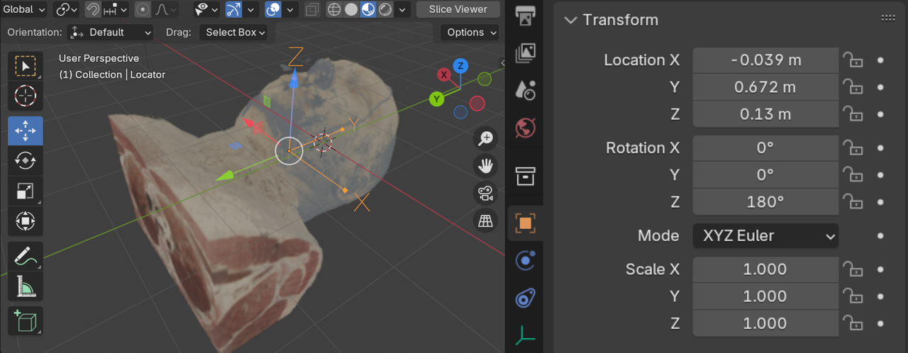
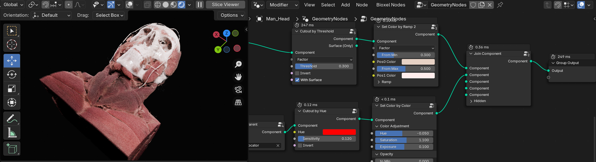
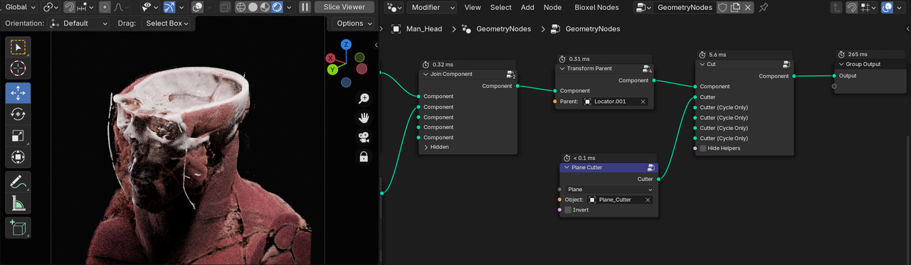
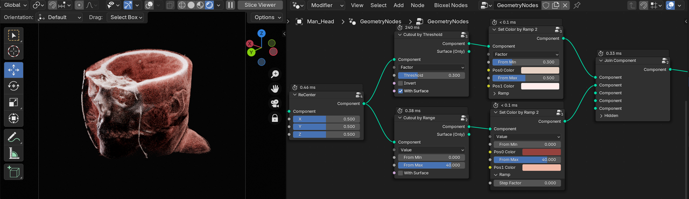
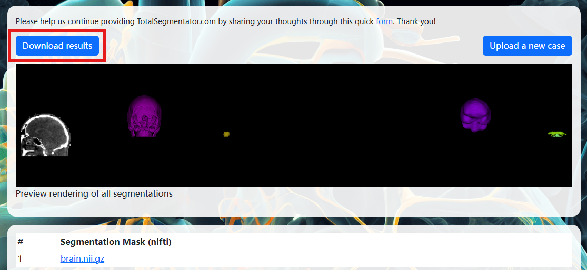

# Advanced Usage

## Concepts

In the previous section, I mentioned some key concepts, I'll describe them in detail so that you can better understand the following operations.

### Container

First is the **Container**, it is the easiest to describe, you can think of it as a scene, or a solver container. it is the stage that carries all stuffs.

### Layer

Second is the **Layer**, which represents different fields of data under the same location in container of the same subject. Just as view layers in any map app, one as roads, one as satellite view, while in Bioxel, one as MRI, one as CT, one as electrical signals, etc. Some layers are for material, such as color, density, etc., we call them **Material Layer**. One container contains different layers of one subject each. Any external data imported into the container is converted into the layer.

### Component

Finally, the **Component**, which is a fragment of **Material Layer**. Multiple materials (Matters) may exist within the same area with different meanings of presentation, like objects in blender, each representing a part of the scene. Bioxel Nodes provides a series of nodes and tools that allow the user to create material layers (Components) based on the other layers (serve as source data), In the previous section, we used the CT data (layer) to make the material (matter) of skull, this process known as materialization.

## Attache the Muscles to the Skull

Multiple components can exist in one container, just as multiple objects can exist in one scene. They can be controlled individually or combined with each other to build complex scenes. Next, let's try cutouting muscle from the VHP anatomical images and attaching the muscles to the skull that created in the previous section. The anatomical images are very large, so I've cropped and scaled them down to 1/4 of their original size for ease of use. Download the file and unzip it into a new directory.

[VHP_M_AnatomicalImages_Head.zip](https://drive.google.com/file/d/164AjQX0tmgUpWZlleJ5i1IKHco4ytDu2/view?usp=drive_link)

You can also download the data directly from the official website, [https://data.lhncbc.nlm.nih.gov/public/Visible-Human/Male-Images/PNG_format/head/index.html](https://data.lhncbc.nlm.nih.gov/public/Visible-Human/Male-Images/PNG_format/head/index.html)

First import the CT data as described in [step by step](step_by_step.md). Then import the anatomical images, but unlike before, this time from the Geometry Nodes menu of the existing container (not the top menu), click **Bioxel Nodes > Import Volumetric Data (Init) > as Color**, locate to the unzipped folder, and select any .png file (do not multi-select, and do not select the folder). This way the imported layer will be in the same container as the previous CT data. You can also import by dragging it into the container geometry node interface instead of the 3D Viewport interface. Also note that **as Color** (not as Scalar) is clicked because the anatomical images are RGB data.

Let's take more time in the import options this time 🫡, first let's talk about what the **Original Spacing** is in the options, you can simply think of it as the original "pixel size" of a image, since the volume is 3D, its pixels (i.e., voxels) are cuboids with a length, width, and height rather than 2D rectangles. And their length, width, and height size is the **Spacing**.

Normally, Bioxel Nodes can read the spacing from the data header, and you don't need to fill in the value, but there is no record of that in any PNG image, so you need to input it manually. in the official description of the VHP, it is mentioned that each pixel of the anatomical images corresponds to the size of .33mm, and the thickness of each slice is 1mm, so the Original Spacing of the anatomical images should be set to `(0.33, 0.33, 1)`.

However, the file I provided is scaled by 1/4 for each image, so the X and Y axes need to be multiplied by 4. So the final Original Spacing should be set to `(1.33, 1.33, 1)`, which should be understandable, right? (If you are importing an official file, then it should still be set to `(0.33, 0.33, 1)`)
Layer Name should be set to "Anatomical Images", other options remain default, click Ok.

After importing, connect the "Cutout by Hue" node (Add > Bioxel Nodes > Component > Cutout by Hue) after the newly created "Fetch Layer" node, and turn on the Slice Viewer mode preview, as shown below.

In addition to spacing, the Dicom file also records the subject's position and orientation, but those information is apparently not recorded in PNG format. This results in a mismatch between the CT data and the anatomical images in position. We need to manually align this two layers: First, set the threshold of the "Cutout by Threshold" node to 0.2 so that the full head can be cutouted and displayed. Then add "ReCenter" node before "Cutout by Hue" node and "Cutout by Threshold" node each, then add Locater to the "anatomical images" workflow (see [step by step](step_by_step.md) for details), and finally add "Join Component" node (Add > Bioxel Nodes > Component > Join Component), and connect them as shown below, with the parameters set as shown.

The "Join Component" node allows you to merge two components together. Move and rotate the Locater object so that the two components are exactly the same in position. If you're having trouble matching them up, here's the exact transform values to fill in the Locater object properties.

Next let's cutout the muscles individually.

First let's talk about the "Cutout by Hue" node. Literally, it cutout regions by hue of color. If you select this node and press "M" key to temporarily mute it, you'll see that the data becomes a cube with blue parts in Slice Viewer mode. the default value of Hue in the "Cutout by Hue" node is red, meaning that the node retains areas of the body that are close to red, and strip out the blue, which is on the opposite side of the red in the hue ring, leaving the human body parts.

If you turn down the value of Sensitivity, you'll see that the visabile part is decreasing, leaving only the part more closer to red, and the muscle happens to be red, so we can easily cutout the muscle. The color of the specimen tissue is not as vibrant as it is in the live state, and we can fine-tune the color to restore the vibrancy by using the "Set Color by Color" node (Add > Bioxel Nodes > Property > Set Color by Color).

To finally put it all together, connect and set the nodes as shown below, where the two colors in "Set Color by Ramp 2" node are `E7D2C5` and `FFEDEC`. If everything is working correctly, you'll get the rendering below.

You can also add "Transfrom" and "Cutter" nodes at the end and all components.

The multimodal data of VHP do not have any deformation or scaling differences, but only positional differences, so all data can be aligned easily. However, in most cases, the differences of different modalities are so great that they need to be registered first, which is not possible with Bioxel Nodes at the moment (but it is in plan). Nevertheless, you can build different components based on the same layer and combine them together. For example, based on the CT data, with the "Cutout by Range" node, you can eliminate the low value regions (fat), eliminate the high value regions (bone), and you can still get the muscle. And then attach it to the skull.

However, the CT values of brain and muscle are very close to each other, so it is extremely difficult to separate the brain from the muscle by threshold. So how should cutout the brain?

## Cutout the Brain

We can use AI technology to realize the division of brain regions, this process is called Segmentation, and the brain regions are as label. There are many models and methods for medical image segmentation, here we recommend [Total Segmentator](https://github.com/wasserth/TotalSegmentator).

It is an out-of-the-box CT/MRI medical image segmentation Python library. You can deploy Total Segmentator locally or process your data through the official online site [https://totalsegmentator.com](https://totalsegmentator.com).

Let me demonstrate the operation, we are still using the CT data from VHP. Click on "Drop DICOM.zip or ..." and select the VHP_M_CT_Head.zip file. Enter "brain" below "Selected task", press Enter to confirm. Finally click "Process data" button.

Wait for the uploading and processing, after all, you will be redirected to the following page, click "Download results" button, download and unzip segmentations.zip to any folder directory.

In case you can't get the brain segment (label), you can download it directly (without unzipping it).

[VHP_M_CT_Head_Brain.nii.gz](https://drive.google.com/file/d/1KGiZ3G11YLXkGszSrvWQ9kTF4TMpxUPd/view?usp=drive_link)

Next we import the brain segment (label) into the container in the same way as we imported the anatomical imagess(under the same container), but this time selecting **as Label**, with the Layer Name set to "Brain", and leaving the other options as default. Once the import is complete, a new "Fetch Layer" node will be added. Create and set the node as shown below, and you should be able to see the surface of brain.

Do you see the "step" like shape on surface? this is due to the low precision of the AI segmentation results. So How to addressing the issue? Select the Fetch Layer node of the brain label, right-click to pop up menu, click **Bioxel Nodes > Resample Value**, in the dialog box, change the "Smooth Size" to 3 or higher (the higher it is, the slower the calculation will be), click OK and wait for the calculation to finish. When it is done, a new layer will be added, replace the original one, is it smoother? The following figure lists different levels of smoothing.

The smoother it is, the more comfortable it looks, but it also means that more details are lost and the calculation is slower.

But if you cut the brain, you will find that the cross-section is homogeneous, this is because the label type layer is does not contain any modality data itself. Bioxel Nodes provides a function to fill in any layer values by label, if you set the value below brain tissue in the non-brain region of CT data, then any "Cutout" node will only keep the brain region.

The operation is like this, select the "Fetch Layer" node of the CT data, right-click to pop up the menu, click **Bioxel Nodes > Fill Value by Label**, in the dialog box, Label is set to the newly imported brain label layer, Fill Value is set to -100 (as long as it is less than the Hu value of the brain tissue), click OK. wait for the data processing, a new data layer will be added to the container when it is finished.

As shown in the following figure, connect the nodes and set the node parameters, in which the two colors of "Set Color by Ramp 2" node are `B26267` and `EBC5B7`, and the "Cutout by Range" and "Set Color by Ramp 2" node are changed to "Value" mode (the default is "Factor" mode), because the maximum and minimum values of the brain are too close to each other and difficult to adjust in "Factor" mode. To make the brain tissue look more transparent, I add the "Set Properties" (Add > Bioxel Nodes > Property > Set Properties) node at the end and changed the "Density" to 0.5.

(Still feel not smooth enough? It's really hard to get rid of "step" surface completely at the moment)

Now the brain is done. Finally we combine all together and you get something like the following.

🤗 If you've followed the docs up to this point, give yourself a round of applause, you've mastered this addon! If you have trouble following the docs instruction, you can download the project files to understand how the nodes work.

[VHP.zip](https://drive.google.com/file/d/1EHB7sxNSvJNwmoTfFnpyOSsm2M_2Y0hO/view?usp=sharing)

AI segmentation is an essential part of volumetric data visualization. Therefore, the future Bioxel Nodes will integrate some commonly used AI segmentation models, so that users can complete the volumetric data visualization in place!
