# 高级用法

## 概念

在上一节中，我提到了一些关键概念，这里我将详细描述它们，以便您更好地理解后续操作。

### 容器

首先是 **容器 (Container)**，它最容易描述，您可以将其想象为一个场景，或一个求解器容器。它是承载所有内容的舞台。

### 图层

其次是 **图层 (Layer)**，它表示同一容器中同一对象在不同位置的不同数据字段。就像任何地图应用中的视图图层，一个显示道路，一个显示卫星图，而在 Bioxel 中，一个显示 MRI，一个显示 CT，一个显示电信号等。有些图层用于材质，如颜色、密度等，我们称它们为 **材质图层 (Material Layer)**。一个容器包含同一对象的不同图层。任何导入容器的外部数据都会转换为图层。

### 组件

最后是 **组件 (Component)**，它是 **材质图层** 的一个片段。同一区域中可能存在多个具有不同呈现意义的材质（物质），就像 Blender 中的对象，每个代表场景的一部分。Bioxel Nodes 提供了一系列节点和工具，允许用户基于其他图层（作为源数据）创建材质图层（组件）。在上一节中，我们使用 CT 数据（图层）来制作颅骨的材质（物质），这个过程称为**材质化 (materialization)**。

## 将肌肉附着到颅骨

一个容器中可以存在多个组件，就像一个场景中可以存在多个对象一样。它们可以单独控制，也可以相互组合以构建复杂的场景。接下来，让我们从 VHP 解剖图像中提取肌肉，并将其附着到上一节创建的颅骨上。解剖图像非常大，为了便于使用，我将其裁剪并缩放到原始大小的 1/4。下载文件并解压到新文件夹。

[VHP_M_AnatomicalImages_Head.zip](https://drive.google.com/file/d/164AjQX0tmgUpWZlleJ5i1IKHco4ytDu2/view?usp=drive_link)

您也可以直接从官方网站下载数据：[https://data.lhncbc.nlm.nih.gov/public/Visible-Human/Male-Images/PNG_format/head/index.html](https://data.lhncbc.nlm.nih.gov/public/Visible-Human/Male-Images/PNG_format/head/index.html)

首先按[分步指南](step_by_step.md)中所述导入 CT 数据。然后导入解剖图像，但与之前不同的是，这次从现有容器的几何节点菜单（不是顶部菜单）中点击 **Bioxel Nodes > Import Volumetric Data (Init) > as Color**，定位到解压后的文件夹，选择任意一个 .png 文件（不要多选，也不要选择文件夹）。这样导入的图层将与之前的 CT 数据位于同一容器中。您也可以通过将其拖入容器几何节点界面而不是 3D 视图界面来导入。另外请注意，点击的是 **as Color**（而不是 as Scalar），因为解剖图像是 RGB 数据。

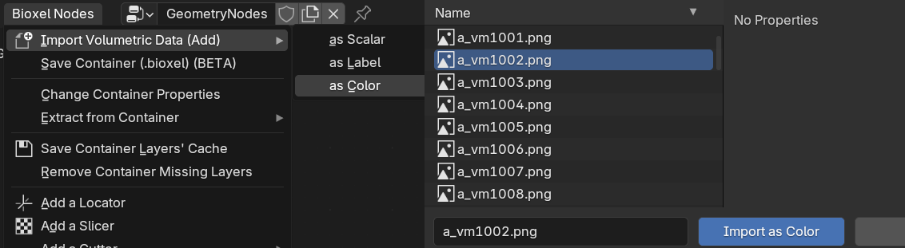

这次让我们在导入选项上多花点时间。首先谈谈选项中的 **Original Spacing** 是什么，您可以简单地将其理解为图像的原始"像素大小"。由于体数据是 3D 的，其像素（即体素）是长方体而不是 2D 矩形，它们有长度、宽度和高度，这就是 **Spacing**。

通常，Bioxel Nodes 可以从数据头文件中读取间距，您不需要填写该值，但任何 PNG 图像都没有记录该信息，因此您需要手动输入。在 VHP 的官方说明中，解剖图像的每个像素对应 0.33mm 的大小，每个切片的厚度为 1mm，因此解剖图像的 Original Spacing 应设置为 `(0.33, 0.33, 1)`。

但是，我提供的文件已将每个图像缩放了 1/4，因此 X 和 Y 轴需要乘以 4。所以最终的 Original Spacing 应设置为 `(1.33, 1.33, 1)`，这应该很容易理解，对吧？（如果您导入的是官方文件，则仍应设置为 `(0.33, 0.33, 1)`）
Layer Name 应设置为 "Anatomical Images"，其他选项保持默认，点击确定。

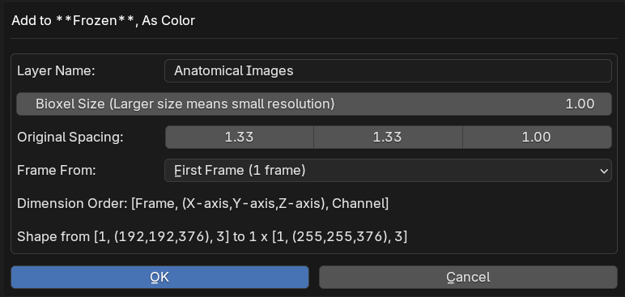

导入完成后，在新创建的 "Fetch Layer" 节点之后连接 "Cutout by Hue" 节点（Add > Bioxel Nodes > Component > Cutout by Hue），并打开 Slice Viewer 模式预览，如下图所示。

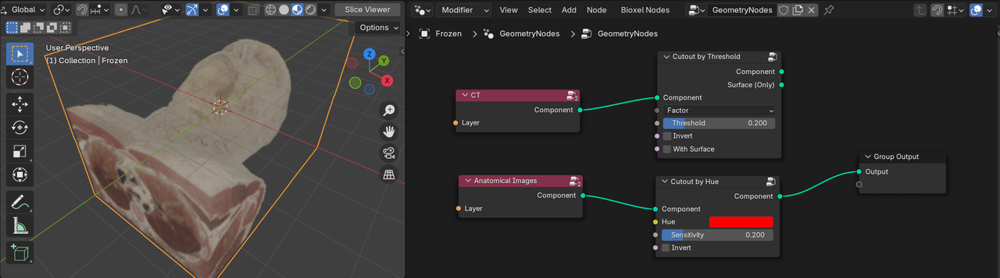

除了间距，Dicom 文件还记录了对象的位置和方向，但这些信息显然没有记录在 PNG 格式中。这导致 CT 数据和解剖图像在位置上不匹配。我们需要手动对齐这两个图层：首先，将 "Cutout by Threshold" 节点的阈值设置为 0.2，以便可以提取并显示完整的头部。然后在 "Cutout by Hue" 节点和 "Cutout by Threshold" 节点之前各添加一个 "ReCenter" 节点，然后在"解剖图像"工作流程中添加 Locater（详见[分步指南](step_by_step.md)），最后添加 "Join Component" 节点（Add > Bioxel Nodes > Component > Join Component），并按如下图所示连接和设置参数。

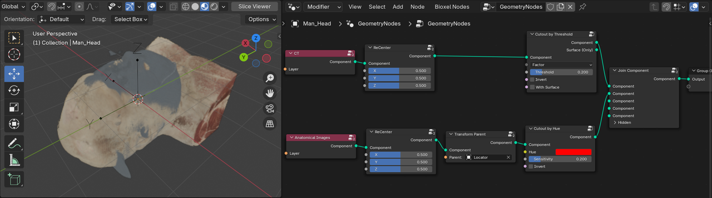

"Join Component" 节点允许您将两个组件合并在一起。移动和旋转 Locater 对象，使两个组件的位置完全一致。如果您难以对齐，以下是 Locater 对象属性的精确变换值。

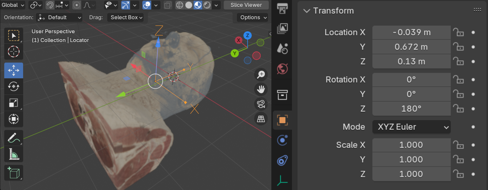

接下来让我们分别提取肌肉。

首先谈谈 "Cutout by Hue" 节点。它的名称表明通过颜色色调提取区域。如果您选择此节点并按 "M" 键暂时静音它，您会看到数据在 Slice Viewer 模式下变成一个带有蓝色部分的立方体。"Cutout by Hue" 节点的默认 Hue 值是红色，这意味着该节点保留接近红色的区域，并去除蓝色（它在色调环上与红色相对），留下人体部分。

如果调低 Sensitivity 的值，您会看到可见部分减少，只留下更接近红色的部分，而肌肉恰好是红色的，因此我们可以轻松提取肌肉。标本组织的颜色不如活体状态那样鲜艳，我们可以使用 "Set Color by Color" 节点（Add > Bioxel Nodes > Property > Set Color by Color）来微调颜色以恢复活力。

最后，按如下图所示连接和设置节点，其中 "Set Color by Ramp 2" 节点中的两个颜色是 `E7D2C5` 和 `FFEDEC`。如果一切正常，您将获得如下图所示的渲染结果。

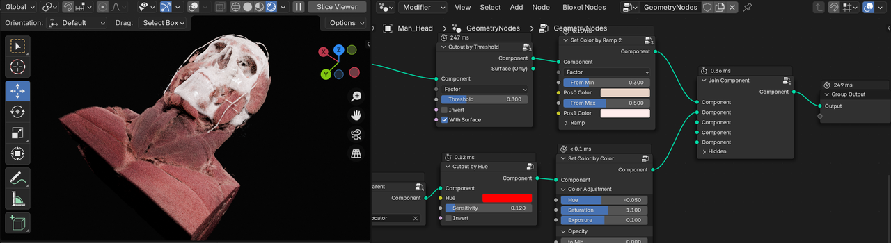

您还可以在末尾和所有组件上添加 "Transform" 和 "Cutter" 节点。

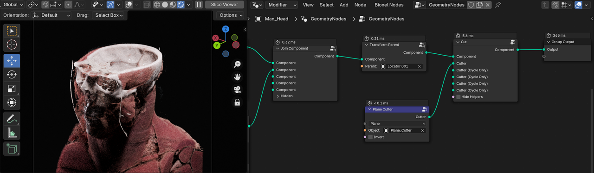

VHP 的多模态数据没有任何变形或缩放差异，只有位置差异，因此所有数据都可以轻松对齐。然而，在大多数情况下，不同模态之间的差异非常大，需要先进行配准，目前 Bioxel Nodes 尚不支持（但在计划中）。尽管如此，您可以基于同一图层构建不同的组件并将它们组合在一起。例如，基于 CT 数据，使用 "Cutout by Range" 节点可以消除低值区域（脂肪），消除高值区域（骨骼），仍能得到肌肉。然后将其附着到颅骨上。

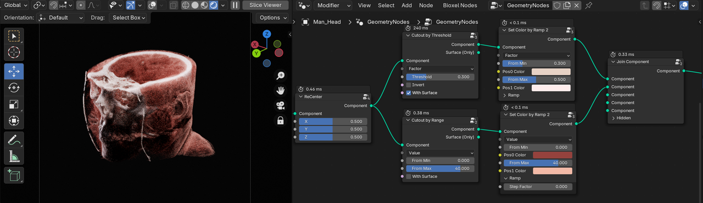

然而，大脑和肌肉的 CT 值非常接近，因此通过阈值将大脑与肌肉分离极其困难。那么应该如何提取大脑呢？

## 提取大脑

我们可以使用 AI 技术来实现大脑区域的划分，这个过程称为**分割 (Segmentation)**，大脑区域称为**标签 (Label)**。医学图像分割有很多模型和方法，这里推荐 [Total Segmentator](https://github.com/wasserth/TotalSegmentator)。

这是一个开箱即用的 CT/MRI 医学图像分割 Python 库。您可以在本地部署 Total Segmentator，也可以通过官方在线网站 [https://totalsegmentator.com](https://totalsegmentator.com) 处理您的数据。

让我演示一下操作，我们仍然使用 VHP 的 CT 数据。点击 "Drop DICOM.zip or..." 并选择 VHP_M_CT_Head.zip 文件。在 "Selected task" 下方输入 "brain"，按 Enter 确认。最后点击 "Process data" 按钮。

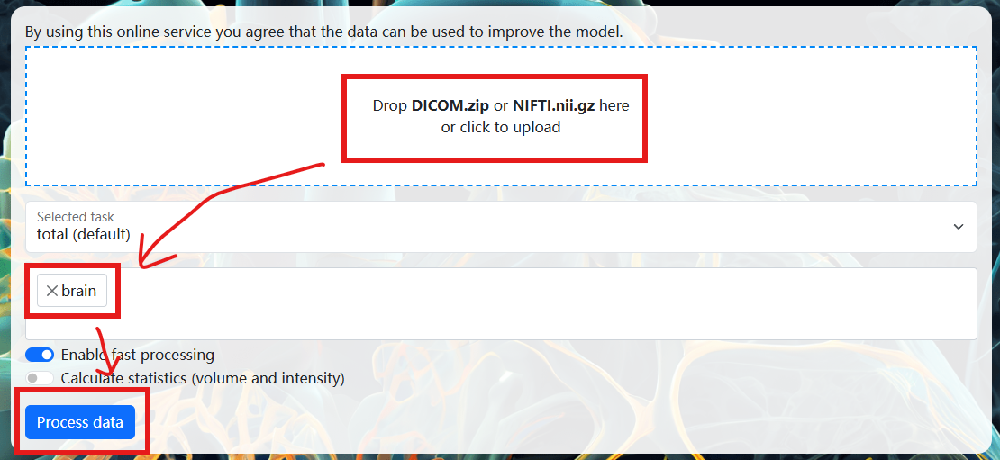

等待上传和处理，之后您将被重定向到以下页面，点击 "Download results" 按钮，下载并解压 segmentations.zip 到任意文件夹。

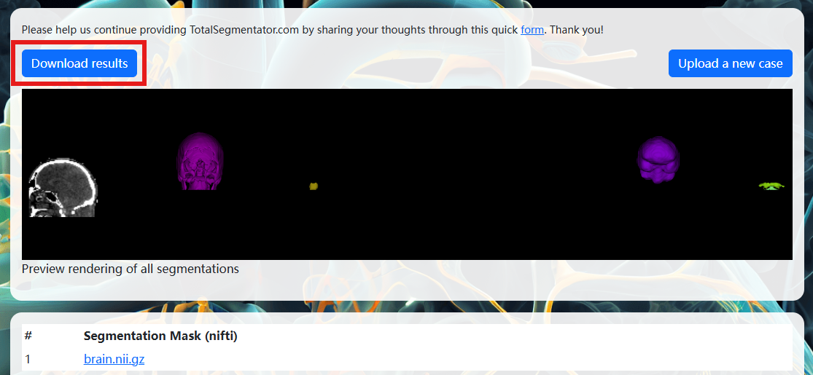

如果您无法获取大脑分割（标签），可以直接下载（无需解压）。

[VHP_M_CT_Head_Brain.nii.gz](https://drive.google.com/file/d/1KGiZ3G11YLXkGszSrvWQ9kTF4TMpxUPd/view?usp=drive_link)

接下来，我们以与导入解剖图像相同的方式将大脑分割（标签）导入到容器中（在同一容器下），但这次选择 **as Label**，Layer Name 设置为 "Brain"，其他选项保持默认。导入完成后，会添加一个新的 "Fetch Layer" 节点。按如下图所示创建和设置节点，您应该能够看到大脑表面。

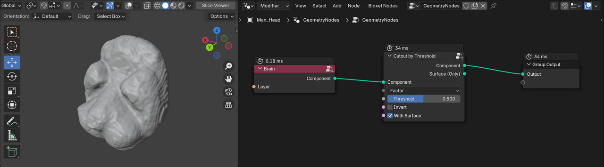

您看到表面上有"台阶"状的形状了吗？这是因为 AI 分割结果精度较低。那么如何解决这个问题？选择大脑标签的 Fetch Layer 节点，右键弹出菜单，点击 **Bioxel Nodes > Resample Value**，在对话框中，将 "Smooth Size" 更改为 3 或更高（数值越高，计算越慢），点击确定并等待计算完成。完成后，会添加一个新的图层，替换原来的图层，它更平滑了吗？下图列出了不同平滑级别的效果。

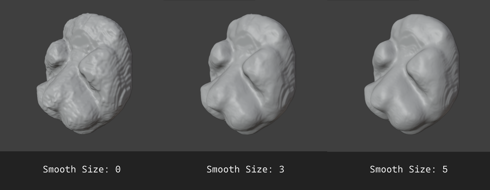

越平滑，看起来越舒服，但这也意味着丢失更多细节，计算也更慢。

但是，如果您切开大脑，会发现截面是均匀的，这是因为标签类型图层本身不包含任何模态数据。Bioxel Nodes 提供了一种通过标签填充任意图层值的功能，如果您将 CT 数据中非大脑区域的脑组织值设置得低于大脑组织的 Hu 值，那么任何 "Cutout" 节点将只保留大脑区域。

操作如下：选择 CT 数据的 "Fetch Layer" 节点，右键弹出菜单，点击 **Bioxel Nodes > Fill Value by Label**，在对话框中，Label 设置为新导入的大脑标签图层，Fill Value 设置为 -100（只要小于大脑组织的 Hu 值即可），点击确定。等待数据处理，完成后会向容器添加一个新的数据图层。

如下图所示，连接节点并设置节点参数，其中 "Set Color by Ramp 2" 节点的两个颜色是 `B26267` 和 `EBC5B7`，"Cutout by Range" 和 "Set Color by Ramp 2" 节点改为 "Value" 模式（默认是 "Factor" 模式），因为大脑的最大值和最小值太接近，在 "Factor" 模式下难以调整。为了使脑组织看起来更透明，我在末尾添加了 "Set Properties"（Add > Bioxel Nodes > Property > Set Properties）节点并将 "Density" 改为 0.5。

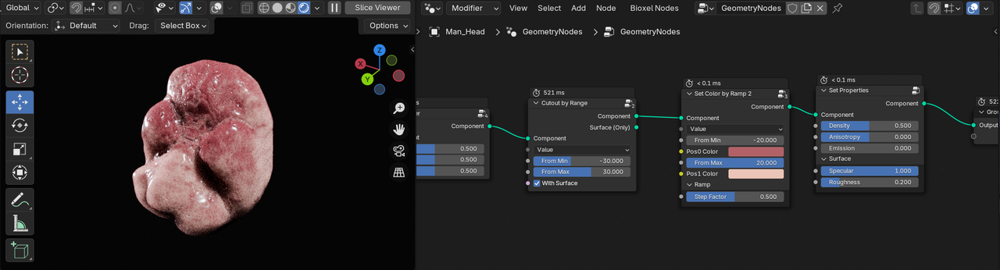

（仍然觉得不够平滑？目前很难完全摆脱"台阶"表面。）

现在大脑完成了。最后，我们将所有内容组合在一起，您将得到如下图所示的结果。

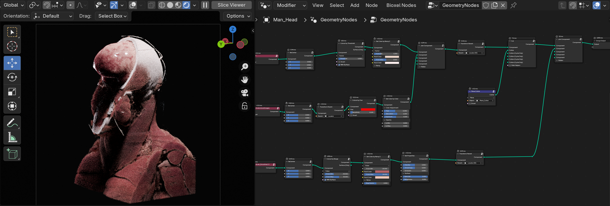

如果您按照文档走到了这一步，为自己鼓掌吧，您已经掌握了这个插件！如果您按照文档操作有困难，可以下载项目文件来理解节点的工作方式。

[VHP.zip](https://drive.google.com/file/d/1EHB7sxNSvJNwmoTfFnpyOSsm2M_2Y0hO/view?usp=drive_link)

AI 分割是体数据可视化的重要组成部分。因此，未来的 Bioxel Nodes 将集成一些常用的 AI 分割模型，让用户可以就地完成体数据可视化！