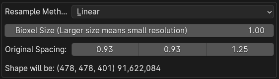
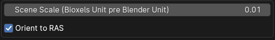

# Features & Options

## Bioxel Design Concept

According to Bioxel design concept, Bioxel Nodes imports volume data and put it into a **Container** as a **Layer**. One container may has more than one layer, and each layer stores the information of different fields under the same location, which is similar to the view layers in map app, except that here it is in 3D space. In order to render the volume the way we want it to, we need to build renderable objects from layers. We call those objects **Component**. The following diagram shows the relationship of **Container**, **Layer**, and **Component**:


Bioxel Nodes staging the layer as an openvdb file. The process of building from layers to a component is taking place in blender geometry nodes graph with blender native geometry nodes. Therefore, **the blender file works without Bioxel Nodes.**

## Container Structure

In Blender, container structure is like this:

```bash
Case_0000 # Container
|-- Case_0000_CT # Layer
|-- Case_0000_Label_1 # Layer
`-- Case_0000_Label_2 # Layer
```

The container also stores the build process in geometry nodes:


The layer is categorized into these by data type:

-   Scalar
-   Label
-   Vector (Not implemented yet)
-   Color (Not implemented yet)

## First Time Import Volume Data

File > Import > Volume Data as Bioxel Layer

### Resample



Sometimes the original data is too big, or the spacing in the original data is not reasonable, you can modify the `Bioxel Size` and `Original Spacing` to adjust the Shape of the layer.

A bioxel is like a pixel, the larger the `Bioxel Size`, the lower the resolution of the image, Original Spacing will be read from the original data record, but sometimes the image doesn't have original spacing, you may need to input it manually to get the correct shape.

### Read as

-   as Scalar

    

    In some cases the environment value is higher than the value of the target object, you can check `Invert Scalar` to adjust the value for better result.

-   as Labels

    Many AI segmentation task datasets, provide segmentation data, which are often an integer value representing a layer of segmentation labels. You can set it to `Labels` to load them.

-   _as Vector (Not implemented yet)_

-   _as Color (Not implemented yet)_

### Others



`Scene Scale` determines how many units of length in the Blender world correspond to one unit of length in the Bioxel world. Since Blender defaults to meters, and the default size of blender primitives are around 1 blender unit. Therefore `Scene Scale` set to 0.01 is appropriate.

`Orient to RAS` determines whether the layer should be converted to the RAS coordinate system. Regardless of the format of the medical image data, the coordinate system is mostly the LPS coordinate system. Bioxel, however, are in the RAS coordinate system and therefore need to be transformed in most cases.

## Adding Volume Data to an existing container

In 3D view or outliner panel, select the container and right click, Bioxel Nodes > Add Volume Data to Container.
The import settings are the same as for the first time import.

## Convert Bioxel Components to Mesh

In 3D view or outliner panel, select the container and right click, Bioxel Nodes > Bioxel Components To Mesh
Once it has been turned into a mesh model, you can perform any traditional 3D editing operations on it, such as sculpting, boolean, etc.

## Export Biovel Layer as VDB

File > Export > Biovel Layer as VDB
