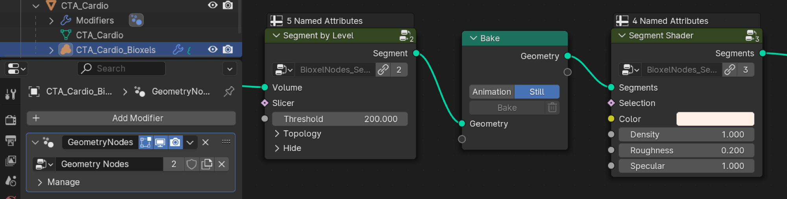

# Getting Started

Currently only support Blender 4.0 or above, make sure you have the correct version of Blender.

### Add-on Installation

Download the latest version https://github.com/OmooLab/BioxelNodes/releases/latest  
In Blender, `Edit - Preferences - Add-ons - Install`, select the `BioxelNodes_{version}.zip` you just downloaded.

### Dependency Installation

The add-on requires a third-party python dependency called SimpleITK, click the Install SimpleITK button below to install the dependency. After clicking, blender may get stuck, it is downloading and installing, just wait for a moment. After the Installation, **restart blender once**.

This step may have failed due to network factors, just click "Set PyPI Mirror" to change the mirror.

### Basic Usage

First you need to have your volumetric data ready. If not, you can access open research data from [Dryad](https://datadryad.org) (Dryad publishes data exclusively under a [Creative Commons Public Domain License](https://creativecommons.org/public-domain/cc0/))

Note: Make sure one folder contains only one sequence, multiple sequences need to be manually split into different folders first.

In Blender, `File - Import - Volume Data as Bioxels`, select **one** of the .dcm files and click on "Volume Data as Bioxels" (you can also drag one of the .dcm files directly into the 3D viewport to trigger the import, but this is limited to .dcm format files)

It may take a while to read data. After finishing reading, it will pop up a dialog box

Ignore the options, just click OK!

After importing, the necessary nodes are automatically added, the reconstruction and shader are created, and then turned on the cycles rendering to directly see the result.

Click select Bioxels Object, and open the Geometry Nodes panel to see the following node graph:

You can change the "Threshold" to modify the reconstruction model, or change the "Color", "Density" to modify the shader effect. All the parameters are straightforward, you can understand them by changing the values.

The node, that named "Segment", is a preset node that combines the steps of 3D reconstruction process and shading process. In general, you need to add one of the segmentation node to reconstruction first, and followed by one of the shader node to set the shader. As you can see in the following figure:

Currently there are 3 types of nodes

- Segmentation nodes, responsible for splitting the volume into a reconstructed model (we call them "Segment").
- Shader nodes, responsible for giving shader to the Segment.
- Slicer nodes, responsible for partially cutting the Segment.

For example:

You can add a "Bake" node between segmentation node and shader node, if the reconstruction process consumes too much computing time. But be sure, you are selecting the volume object, not the container object.

