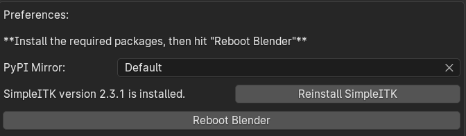
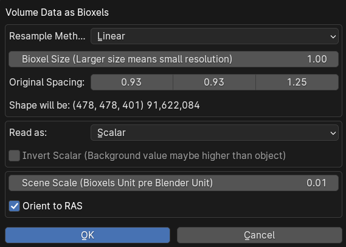
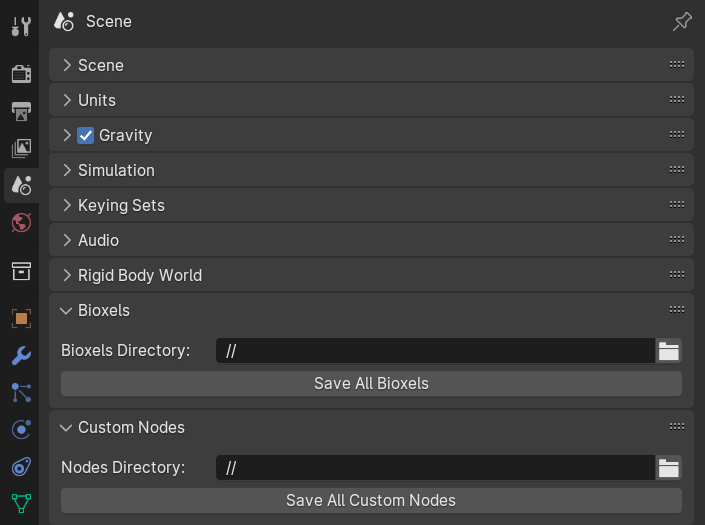

# Getting Started

Currently only support Blender 4.0 or above, make sure you have the correct version of Blender.

## Add-on Installation

Download the latest version https://github.com/OmooLab/BioxelNodes/releases/latest  
In Blender, Edit > Preferences > Add-ons > Install, select the `BioxelNodes_{version}.zip` you just downloaded.

The add-on requires a third-party python dependency called SimpleITK, click `Install SimpleITK` button below to install the dependency. After clicking, blender may get stuck, it is downloading and installing, just wait for a moment. After that, click `Reboot Blender` button.

This step may have failed due to network factors, just click "Set PyPI Mirror" to change the mirror.

## Prepare Your Data

First you need to have your volumetric data ready. If not, you can access open research data from list below：

| Source                                                                               | Object             |
| ------------------------------------------------------------------------------------ | ------------------ |
| [Dryad](https://datadryad.org)                                                       | Open Research Data |
| [OpenOrganelle](https://openorganelle.janelia.org/datasets)                          | Cells              |
| [Embodi3D](https://www.embodi3d.com/files/category/37-medical-scans/)                | Medical Images     |
| [Github](https://github.com/sfikas/medical-imaging-datasets)                         | Medical Images     |
| [NIHR](https://nhsx.github.io/open-source-imaging-data-sets/)                        | Medical Images     |
| [Medical Segmentation Decathlon](http://medicaldecathlon.com/)                       | Medical Images     |
| [Allen Cell Explorer](https://www.allencell.org/3d-cell-viewer.html)                 | Cells              |
| [Visible Human Project](https://www.nlm.nih.gov/research/visible/visible_human.html) | Medical Images     |

## Import Volume Data

File > Import > Volume Data as Bioxels, select **one** of the .dcm files and click on "Volume Data as Bioxels" (you can also drag one of the .dcm files directly into the 3D viewport to trigger the import)

It may take a while to read data. After finishing reading, it will pop up a dialog box

Ignore the options, just click OK!

After importing, the necessary nodes are automatically added, the reconstruction and shader are created. Click select Bioxels Object, and open the Geometry Nodes panel, change the "Threshold" in segment node.

and then turned on the cycles rendering to directly see the result.

You can change the "Threshold" to modify the reconstruction model, or change the "Color", "Density" to modify the shader effect. All the parameters are straightforward, you can understand them by changing the values.

## Share Your File

The VDB cache and the Bioxel nodes are not reachable to computers if you don't save them. If you need to give your blender file to someone else, you will need to perform the following steps:

1. Save your blender file
2. Click Scene > Bioxels > Save All Bioxels in the Properties panel.
3. Click Scene > Custom Nodes > Save All Custom Nodes under the Properties panel.

After that, both the VDB cache and the Bioxel nodes are stored in relative locations. When you share a file with someone, pack the entire directory so that the resources are not lost. The other person will be able to load correctly, regardless of whether they have BioxelNodes installed.