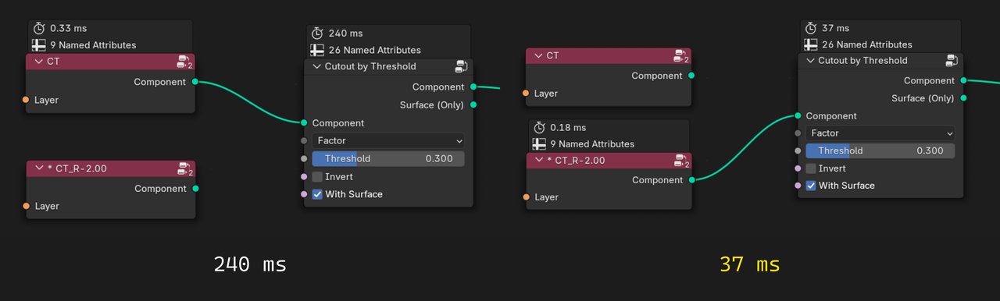
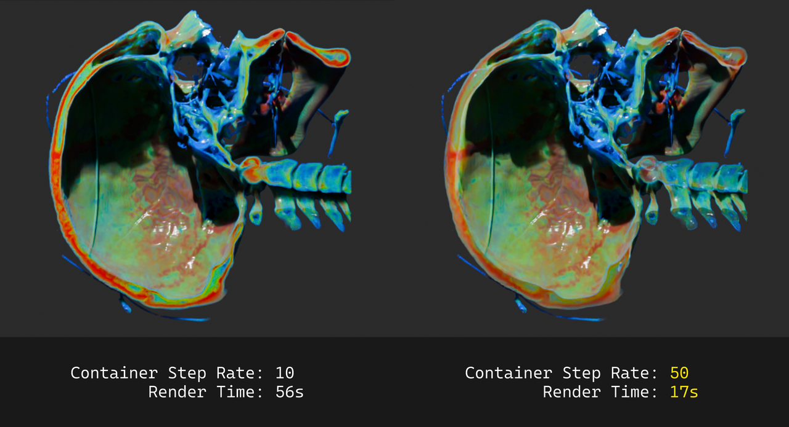
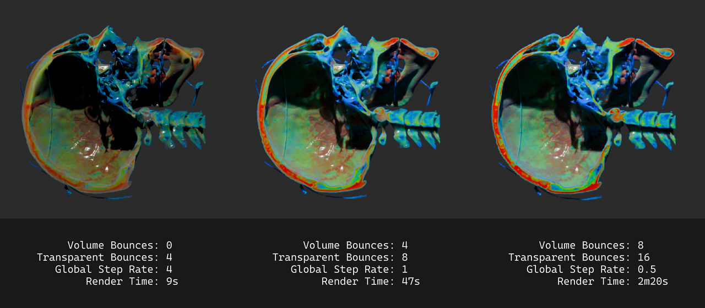

# Improve Performance

Volume reconstruction and volume rendering are very consuming computation, I believe that this add-on's experience is terrible on poorly hardware. here are tips to improve the add-on performance.

## Use Low-Res Data as Preview

The addon provides data resample function, the operation is as follows. First, in the container's geometry node, select the layer you need to resample, right-click **Bioxel Nodes > Resample Value**, in the dialog box, change the "Bioxel Size" value to twice or more than the current value, click OK. the addon will create a low-res version of the layer and load it into the container's geometry node.

You can see that the speed of the reconstruction has been reduced from 240 ms to 37 ms, making it possible to compute in almost real-time, and improving the speed of the feedback of the changing the parameters. Once you are satisfied with the adjustment, you can then connect the original layer to the nodes. This tip can greatly improve the operation experience of the node.

## Raise the Step Rate of a Container

Step rate is a key setting in volume rendering. The higher the step rate, the faster the rendering will be, but at the same time, the thinner the volume will look. If you want to have a very thin effect, or if you don't need to cut through component, you can always set the step rate high, you can adjust step rate in the render settings globaly. However, I recommend you to adjust the step rate of the container separately, so that it doesn't affect the rendering of the other volume in the Blender file, do as follows.

In the container's geometry nodes panel menu, click **Bioxel Nodes > Change Container Properties**, in the dialog box, raise the "Step Rate" value (up to 100) and click OK.

You can see that the rendering speed is much higher, but at the same time the cuts look blurry and transparent.

## Balance rendering settings

I list some of the settings that affect the volume rendering most, so you can find the most balanced settings for your needs.

-   **Light Paths > Max Bounces > Volume** affects the number of bounces a volume has, the higher the value, the more transparent it will look.

-   **Light Paths > Max Bounces > Transparent** affects the number of times transparent surfaces are transmitted, the higher the value, the more transparent it will look.

-   **Volumes > Step Rate Render | Viewport** affects the volume rendering step, the smaller the value, the more detailed the volume will look

Bioxel Nodes provides some render setting presets for quick setup. In the top menu, click **Bioxel Nodes > Render Setting Presets**, including Performance (left), Balance (center), and Quality (right). Here is a comparison of them.

## Rendering with EEVEE

EEVEE doesn't render volume as well as Cycles, but it does have the advantage of rendering the volumetric data, and is even a better choice if you want to get a clear view of slice. And EEVEE's real-time rendering make it possible to create interactive stuff in Blender.
