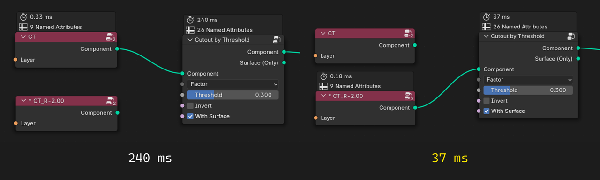
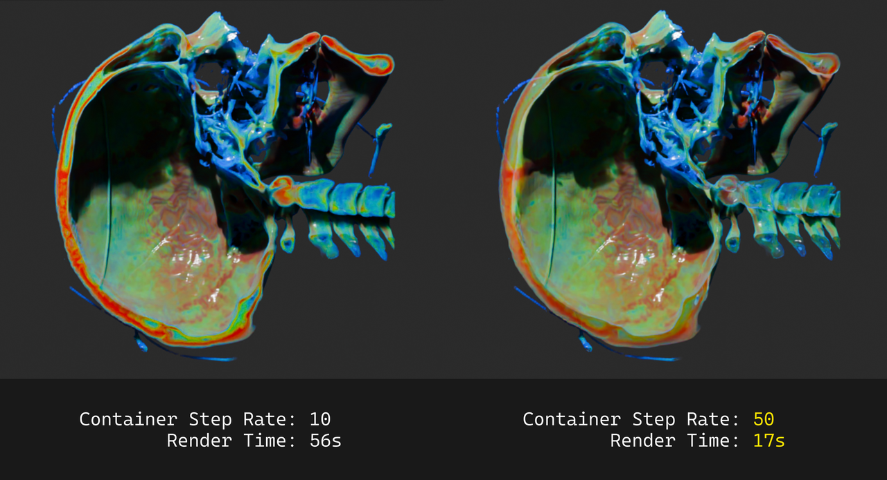
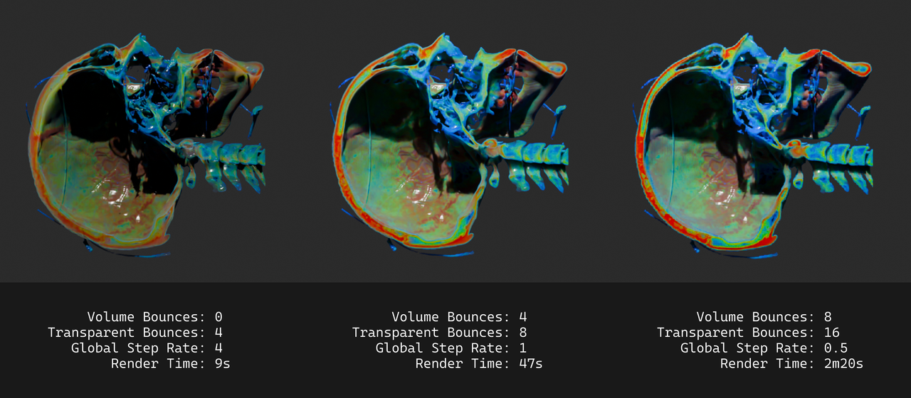

# 提升性能

体数据重建和体渲染是非常消耗计算资源的，我相信这个插件在性能较差的硬件上体验很差。以下是一些提升插件性能的建议。

## 使用低分辨率数据作为预览

插件提供数据重采样功能，操作如下。首先，在容器的几何节点中，选择需要重采样的图层，右键 **Bioxel Nodes > Resample Value**，在对话框中，将 "Bioxel Size" 值更改为当前值的两倍或更多，点击确定。插件将创建该图层的低分辨率版本并加载到容器的几何节点中。

您可以看到重建速度从 240 ms 降低到 37 ms，使得几乎实时计算成为可能，并提高了参数变化的反馈速度。满意后，您可以将原始图层连接到节点。这个建议可以极大地改善节点操作体验。

## 提高容器的步率

步率是体渲染中的关键设置。步率越高，渲染速度越快，但同时体数据看起来会越薄。如果您想要非常薄的效果，或者不需要切开组件，可以始终将步率设置得很高。您可以在渲染设置中全局调整步率。但是，我建议您单独调整容器的步率，这样不会影响 Blender 文件中其他体数据的渲染，操作如下。

在容器的几何节点面板菜单中，点击 **Bioxel Nodes > Change Container Properties**，在对话框中，提高 "Step Rate" 值（最高可达 100）并点击确定。

您可以看到渲染速度大大提高，但同时切割看起来模糊且透明。

## 平衡渲染设置

我列出了一些对体渲染影响最大的设置，以便您找到最适合自己的平衡点。

- **Light Paths > Max Bounces > Volume** 影响体数据的反弹次数，值越高，体数据看起来越透明。

- **Light Paths > Max Bounces > Transparent** 影响透明表面透射的次数，值越高，透明表面看起来越透明。

- **Volumes > Step Rate Render | Viewport** 影响体渲染的步长，值越小，体数据看起来越精细。

Bioxel Nodes 提供了一些渲染设置预设以便快速配置。点击顶部菜单 **Bioxel Nodes > Render Setting Presets**，包括 Performance（左侧）、Balance（中间）和 Quality（右侧）。以下是它们的比较。

## 使用 EEVEE 渲染

EEVEE 渲染体数据不如 Cycles，但它确实有渲染体数据的优势，如果您想获得清晰的切片视图，它甚至是更好的选择。EEVEE 的实时渲染使得在 Blender 中创建交互式内容成为可能。