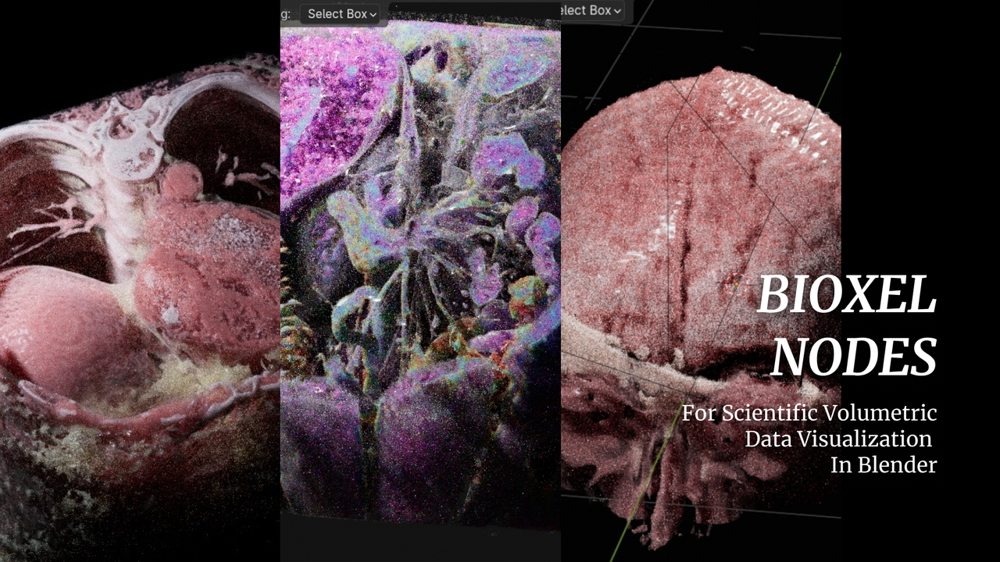

# Bioxel Nodes

Bioxel Nodes is a Blender addon for scientific volumetric data visualization. It using Blender's powerful **Geometry Nodes** and **Cycles** to process and render volumetric data.

-   Fantastic rendering result, also support EEVEE NEXT
-   Support multiple formats
-   Support 4D volumetric data
-   All kinds of cutters
-   Simple and powerful nodes
-   Based on blender natively, can work without addon.

**Click [Getting Started](https://omoolab.github.io/BioxelNodes/latest/installation) to begin your journey into visualizing volumetric data!**

## Support Multiple Formats

| Format | EXT                                      | Test    |
| ------ | ---------------------------------------- | ------- |
| DICOM  | .dcm, .DICOM                             | ✅ pass |
| BMP    | .bmp, .BMP                               | ✅ pass |
| JPEG   | .jpg, .JPG, .jpeg, .JPEG                 | ✅ pass |
| PNG    | .png, .PNG                               | ✅ pass |
| TIFF   | .tif, .TIF, .tiff, .TIFF                 | ✅ pass |
| Nifti  | .nia, .nii, .nii.gz, .hdr, .img, .img.gz | ✅ pass |
| Nrrd   | .nrrd, .nhdr                             | ✅ pass |
| HDF5   | .hdf, .h4, .hdf4, .he2, .h5, .hdf5, .he5 | ✅ pass |

## Support 4D volumetric data

🥰 4D volumetric data can also be imported into Blender.

## Support EEVEE NEXT

👍 EEVEE NEXT is absolutely AWESOME! Bioxel Nodes is fully support EEVEE NEXT now! However, there are some limitations:

1. Only one cutter supported.
2. EEVEE result is not that great as Cycles does.

## Known Limitations

-   Only works with Cycles CPU , Cycles GPU (OptiX), EEVEE
-   Section surface cannot be generated when convert to mesh (will be supported soon)

## Compatibile to Newer Version

**Updating this addon may break old files, so read the following carefully before updating**

Before updating this addon, you need to ask yourself whether this project file will be modified again or not, if it's an archived project file, I would recommend that you run **Bioxel Nodes > Save Staged Data** to make the addon nodes permanent. In this way, there will be no potential problem with the nodes not functioning due to the addon update.

After the addon update, your old project files may not work either, this may be because you had executed **Save Staged Data**. If so, you need to execute **Bioxel Nodes > Relink Nodes to Addon** to relink them to make sure that the addon's new functionality and the addon nodes are synchronized.

Also, unlike the newer versions, the older shaders are not based on OSL, so if you find that you can't render volumes, you need to turn on **Open Shading Language (OSL)** in the Render Settings.

## Roadmap
- Better multi-format import experience
- One-click bake model with texture
- AI Segmentation to Generate Labels