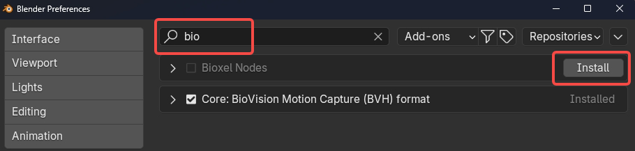

# 安装

**目前仅支持 Blender 4.2 及以上版本，请确保您安装了正确版本的 Blender。**

## 在 Blender 中安装（推荐）

这是最推荐的方式。点击顶部菜单 **Edit > Preferences**，在 "Get Extensions" 区域搜索 "bio"，然后点击 Install。由于插件体积较大（25MB~50MB），可能需要等待一段时间。

## Blender 官方扩展网站

您也可以访问 Blender 官方扩展网站 [https://extensions.blender.org/add-ons/bioxelnodes/](https://extensions.blender.org/add-ons/bioxelnodes/)
点击 Get Add-on，打开 Blender，将插件拖入并按照提示安装。

## 手动安装

您也可以从 [这里](https://github.com/OmooLab/BioxelNodes/releases/latest) 下载 _BioxelNodes_{version}.zip_ 进行手动安装。
点击顶部菜单 **Edit > Preferences**，选择 **Add-ons > Install from Disk**，然后选择您下载的 Zip 文件。