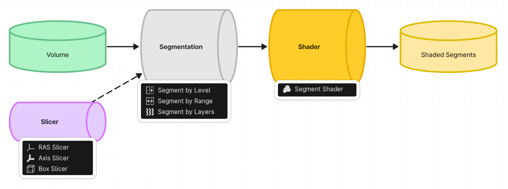
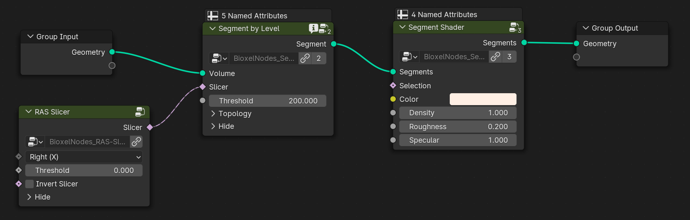

# Geometry Nodes

The node, that named "Segment", is a preset node that combines the steps of 3D reconstruction process and shading process. In general, you need to add one of the segmentation node to reconstruction first, and followed by one of the shader node to set the shader. As you can see in the following figure:

Currently there are 3 types of nodes

-   Segmentation nodes, responsible for splitting the volume into a reconstructed model (we call them "Segment").
-   Shader nodes, responsible for giving shader to the Segment.
-   Slicer nodes, responsible for partially cutting the Segment.

For example:

You can add a "Bake" node between segmentation node and shader node, if the reconstruction process consumes too much computing time. But be sure, you are selecting the volume object, not the container object.

