# Nodes

## Nodes Design Concept

In order to build a component, the general process is to first use a "Mask Method" node to build the surface of the component based on its layers, and then connect to a "Assign Shader" node to add the material physical properties. Finally, if you need to cut the cross-section, then connect to a "Cut" node. The whole process is shown in the following diagram

A typical example looks like this:

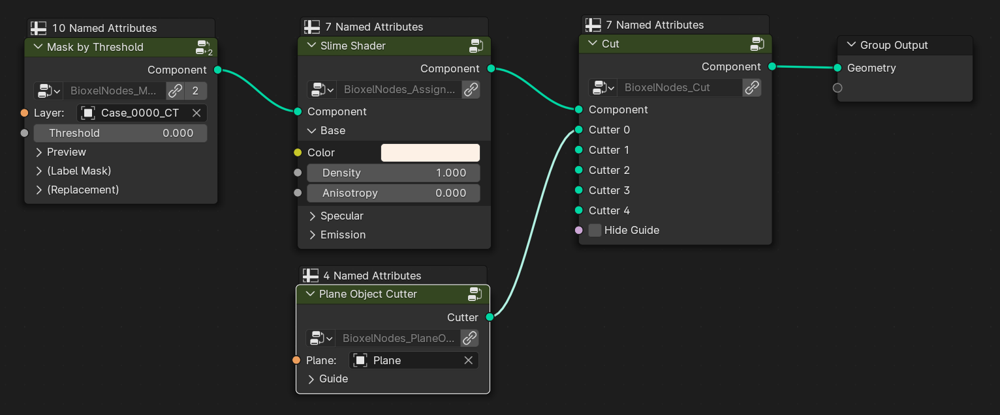

The "Mask Method" node tends to be very computationally intensive, and if it consumes too much time, then you can bake it with a "Bake" node after it (but you need to save the Blender file first).

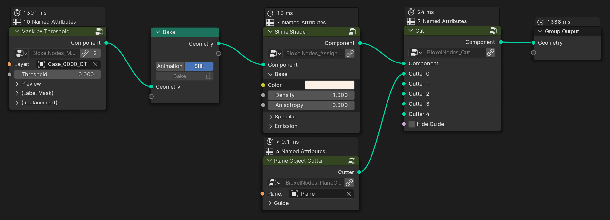

## Mask Methods

This type of node is responsible for culling out the extent of the component that does not need to be rendered, forming the interface between the object and the object, or the surface of the object (i.e., the interface between the object and the air)

### ⬆️ Mask by Threshold

-   

-   Generate a mask by keeping only the positions that exceed the threshold (this only works with scalar)

    ***

    Node Parameter:

    -   **Layer**, _the input scalar_
    -   **Threshold**, _the threshold value_
    -   Preview
        -   **Detail Factor**, _the fineness of the preview, the larger the factor, the coarser preview is_
    -   (Label Mask)
        -   **Layer**, _the input label_
        -   **Invert**, _invert mask_
        -   **Sample Size**, _the mask sample size_
    -   (Replacement)
        -   **Joined**, _the joined layer_

### ↕ Mask by Range

-   

-   Generate a mask by keeping only the positions that in range (this only works with scalar)

    ***

    Node Parameter:

    -   **Layer**, _the input scalar_
    -   **Fram Min**, _the lower limit_
    -   **Fram Max**, _the upper limit_
    -   Preview
        -   **Detail Factor**, _the fineness of the preview, the larger the factor, the coarser preview is_
    -   (Label Mask)
        -   **Layer**, _the input label_
        -   **Invert**, _invert mask_
        -   **Sample Size**, _the mask sample size_
    -   (Replacement)
        -   **Joined**, _the joined layer_

### 🔤 Mask by Label

-   

-   Generate a mask by keeping only the positions that in label (this only works with label)

    ***

    Node Parameter:

    -   **Layer**, _the input label_
    -   Preview
        -   **Detail Factor**, _the fineness of the preview, the larger the factor, the coarser preview is_
    -   (Replacement)
        -   **Joined**, _the joined layer_

## Shaders

This type of node is responsible for setting material physical properties to the component to reflect the differences in rendering effects of different components.

### 🥚 Solid Shader

-   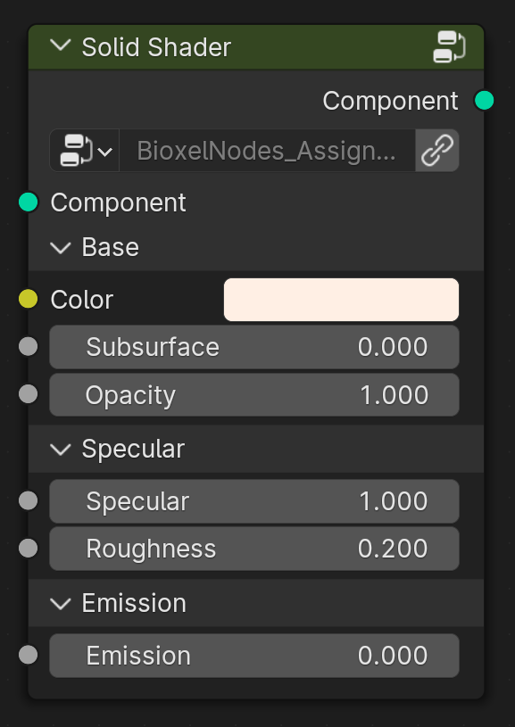

-   Assign a opaque shader based on a preview mesh with no inclusions visible. Fastest rendering speed. Does not support cross-section and color ramp.

    ***

    Node Parameter:

    -   **Component**, _the upstream component_
        -   Base
        -   **Color**, _albedo or emission color_
        -   **Subsurface**, _the subsurface scale_
        -   **Opacity**, _the opacity of all_
    -   Specular
        -   **Specular**, _the specular of surface_
        -   **Roughness**, _the roughness of surface_
    -   Emission
        -   **Emission**, _the emission strength_

### 🦠 Slime Shader

-   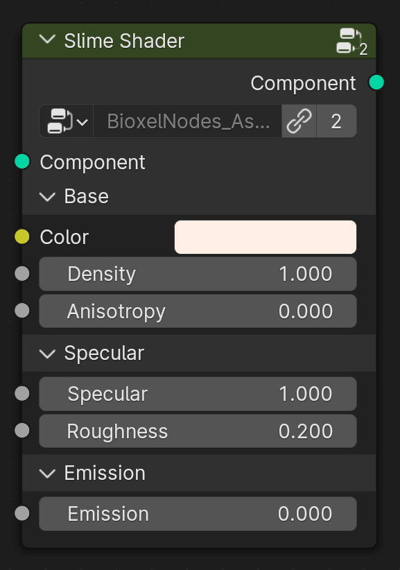

-   Assign a semi-transparent shader based on the preview mesh with visible inclusions. Does not support cross-section and color ramp.

    ***

    Node Parameter:

    -   **Component**, _the upstream component_
    -   Base
        -   **Color**, _albedo or emission color_
        -   **Density**, _the degree of solidity_
        -   **Anisotropy**, _the anisotropy of scatting_
    -   Specular
        -   **Specular**, _the specular of surface_
        -   **Roughness**, _the roughness of surface_
    -   Emission
        -   **Emission**, _the emission strength_

### ☁️ Volume Shader

-   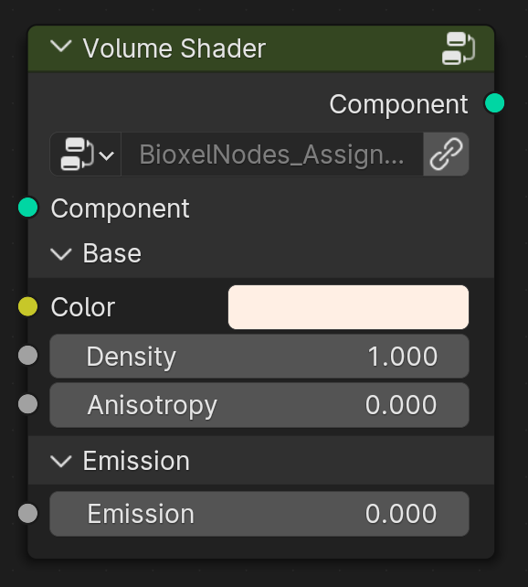

-   Assign a volume-based shader with support for cross-section and color ramp.

    ***

    Node Parameter:

    -   **Component**, _the upstream component_
    -   Base
        -   **Color**, _albedo or emission color_
        -   **Density**, _the degree of solidity_
        -   **Anisotropy**, _the anisotropy of scatting_
    -   Emission
        -   **Emission**, _the emission strength_

### 🔬 Universal Shader

-   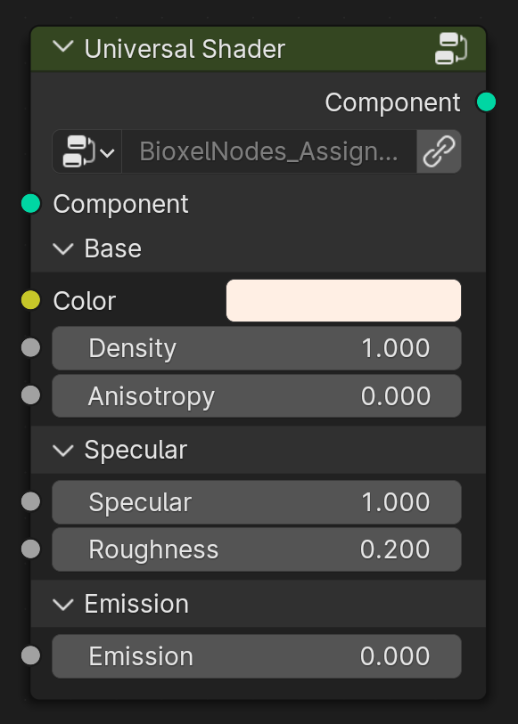

-   Assign a ultimate shader, supporting all features of Bioxel Nodes. Of course, the price is slow rendering, which can be greatly improved by adjusting the Volumes > Step Rate to 100 in the Render Settings Panel.

    ***

    Node Parameter:

    -   **Component**, _the upstream component_
    -   Base
        -   **Color**, _albedo or emission color_
        -   **Density**, _the degree of solidity_
        -   **Anisotropy**, _the anisotropy of scatting_
    -   Specular
        -   **Specular**, _the specular of surface_
        -   **Roughness**, _the roughness of surface_
    -   Emission
        -   **Emission**, _the emission strength_

## Cutters

This type of node is responsible for cutting components to present cross-section

### 🪚 Cut

-   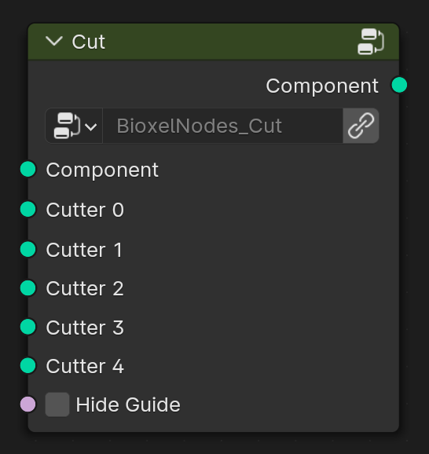

-   Execute all cutters on one component.

    ***

    Node Parameter:

    -   **Component**, _the upstream component_
    -   **Cutter 0~4**, _the cutters_
    -   **Hide Guide**, _hide the cutter guide_

### 🧀 Plane Cutter

-   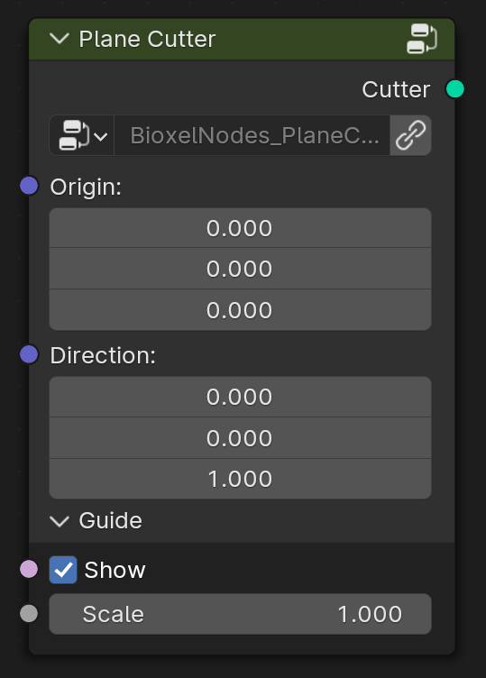

-   Flat plane cutter, cuts off above Z-axis in local.

    ***

    Node Parameter:

    -   **Origin**, _plane cutter position_
    -   **Direction**, _plane cutter orientation_
    -   Guide
        -   **Show**, _show the cutter guide_
        -   **Scale**, _scale the cutter guide_

### 🧀 Plane Object Cutter

-   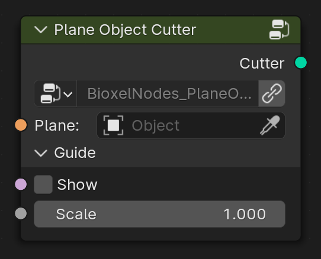

-   Also a plane cutter, but origin and direction are based on exist object.

    ***

    Node Parameter:

    -   **Plane**, _the plane object_
    -   Guide
        -   **Show**, _show the cutter guide_
        -   **Scale**, _scale the cutter guide_

## Utils

### 📦 Join Component

-   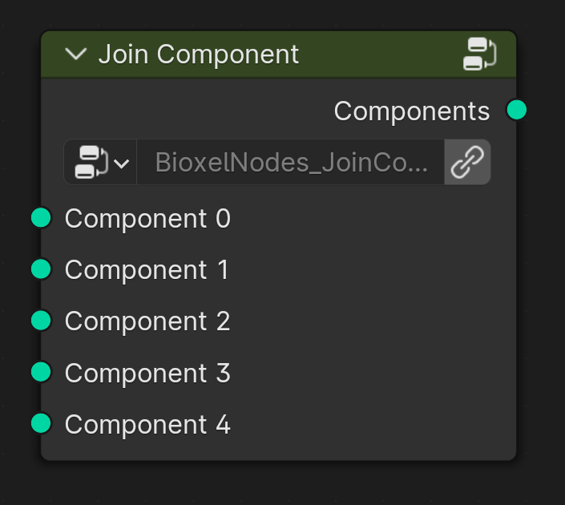

-   Components' combination should not be done by "Join Geometry" node because Blender Cycles can't render volumes in the same position, so the node will slightly offset all components randomly to avoid this problem.

    ***

    Node Parameter:

    -   **Component 0~4**, _the components_

### 🗂️ Separate Component

-   

-   Volumes, previews, and guides are included within a component. This node can split them by type.

    ***

    Node Parameter:

    -   **Component**, _the upstream component_
    -   **Type**, _the sub-object type, 0 is volume, 1 is preview, 2 is guide_

## Colors

This type of node is responsible for setting the color properties of the shader

### 🎨 Color Presents

-   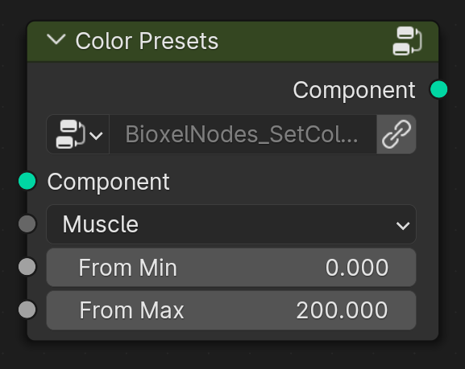

-   Set color from presets.

    ***

    Node Parameter:

    -   **Component**, _the upstream component_
    -   **Presets**, _select color presents_
    -   **Fram Min**, _ramp factor lower limit_
    -   **Fram Max**, _ramp factor upper limit_

### 2️⃣ Color Ramp 2

-   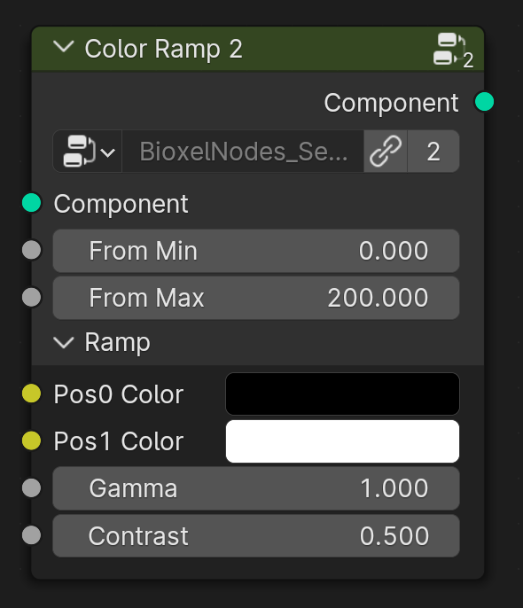

-   Set color ramp base on scalar value.

    ***

    Node Parameter:

    -   **Component**, _the upstream component_
    -   **Fram Min**, _ramp factor lower limit_
    -   **Fram Max**, _ramp factor upper limit_
    -   Ramp
        -   **Pos0 Color**, _position 0% Color_
        -   **Pos1 Color**, _position 100% Color_
        -   **Gamma**, _non-linear coefficient, the larger the coefficient, the more lower value color_
        -   **Contrast**, _the larger the contrast, the harder color ramp will be_

### 3️⃣ Color Ramp 3

-   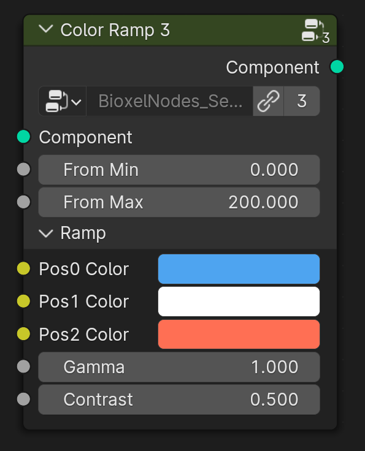

-   Set color ramp base on scalar value.

    ***

    Node Parameter:

    -   **Component**, _the upstream component_
    -   **Fram Min**, _ramp factor lower limit_
    -   **Fram Max**, _ramp factor upper limit_
    -   Ramp
        -   **Pos0 Color**, _position 0% Color_
        -   **Pos1 Color**, _position 50% Color_
        -   **Pos2 Color**, _position 100% Color_
        -   **Gamma**, _non-linear coefficient, the larger the coefficient, the more lower value color_
        -   **Contrast**, _the larger the contrast, the harder color ramp will be_

### 4️⃣ Color Ramp 4

-   

-   Set color ramp base on scalar value.

    ***

    Node Parameter:

    -   **Component**, _the upstream component_
    -   **Fram Min**, _ramp factor lower limit_
    -   **Fram Max**, _ramp factor upper limit_
    -   Ramp
        -   **Pos0 Color**, _position 0% Color_
        -   **Pos1 Color**, _position 33.3% Color_
        -   **Pos2 Color**, _position 66.6% Color_
        -   **Pos3 Color**, _position 100% Color_
        -   **Gamma**, _non-linear coefficient, the larger the coefficient, the more lower value color_
        -   **Contrast**, _the larger the contrast, the harder color ramp will be_

### 5️⃣ Color Ramp 5

-   

-   Set color ramp base on scalar value.

    ***

    Node Parameter:

    -   **Component**, _the upstream component_
    -   **Fram Min**, _ramp factor lower limit_
    -   **Fram Max**, _ramp factor upper limit_
    -   Ramp
        -   **Pos0 Color**, _position 0% Color_
        -   **Pos1 Color**, _position 25% Color_
        -   **Pos2 Color**, _position 50% Color_
        -   **Pos3 Color**, _position 75% Color_
        -   **Pos4 Color**, _position 100% Color_
        -   **Gamma**, _non-linear coefficient, the larger the coefficient, the more lower value color_
        -   **Contrast**, _the larger the contrast, the harder color ramp will be_

