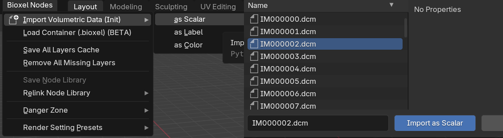
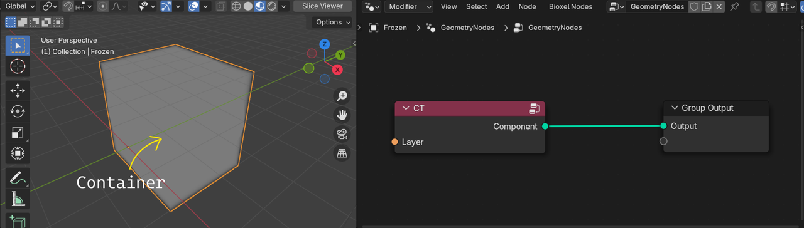
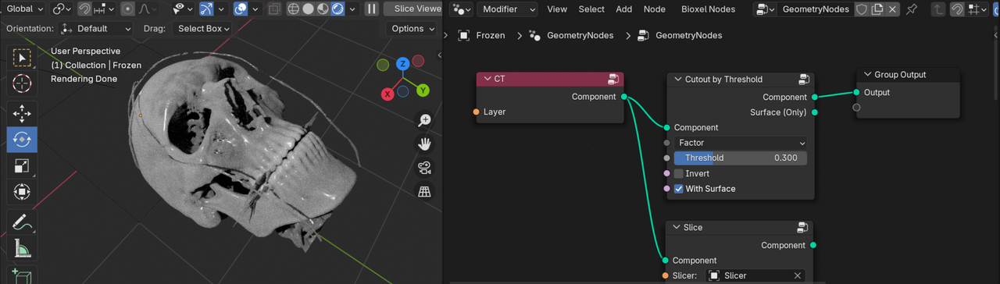
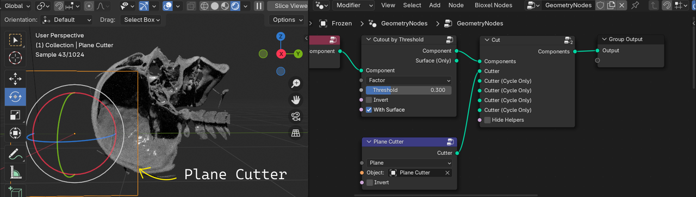
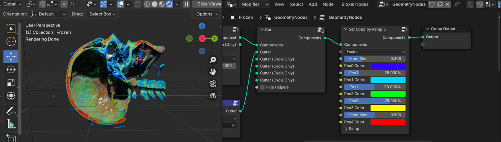

# Step by Step

## Download Data

Here is the open data from [Visible Human Project (VHP)](https://www.nlm.nih.gov/research/visible/visible_human.html) for you to learn how to use this addon. It is a CT scan image of a male head, download and unzip it to a new directry for later usage.

[VHP_M_CT_Head.zip](https://drive.google.com/file/d/1bBGpt5pQ0evr-0-f4KDNRnKPoUYj2bJ-/view?usp=drive_link)

VHP original radiology data was shared in the proprietary format that predated DICOM, complicating its use. Now all data has been harmonized to standard DICOM and released in [NCI Imaging Data Commons (IDC)](https://portal.imaging.datacommons.cancer.gov/), you also can download data from IDC by yourself.

## Import Data

In the top menu, click **Bioxel Nodes > Import Volumetric Data (Init) > as Scalar**, locate to the unzipped folder, select any DICOM file (don't select more than one, and don't select the folder either), and click **Import as Scalar**.

You can also choose to import data by dragging one DICOM file into the 3D viewport (some DICOM files don't have extension suffix and can't be dragged in).

The process of reading the data may take a while, the bottom right corner of the Blender interface will show you the progress of the reading, and a dialog box will pop up when the reading is successful. Ignore all the options for now and just click OK, I will explain the purpose of these options later.

The import process involves data conversion, so there is more waiting time, and the progress of the import is displayed in the lower right corner of the interface. After importing, the addon will create a new object, with a new geometry nodes that will serve as a "workbench" for manipulating the data, the new object is called the **Container**. The newly imported data is stored in the Container as a **Layer**, which is loaded into the Container's Geometry node via the "Fetch Layer" node (the red one), and be converted into a **Component** that can be rendered.

Next, let's preview the data in Blender.

In the container's geometry nodes panel menu, click **Bioxel Nodes > Add a Slicer**. The addon will insert a node named "Slice" between the "Fetch Layer" and the "Output" and create a new plane object named "Slicer". Click the "Slice Viewer" button in the upper right corner of the 3D viewport to enter the preview mode, then move and rotate the "Slicer" object. You will see a slice image of the data, which should be familiar to anyone who has used any DICOM viewing software.

(If the volume disappears when you click the "Slice Viewer" button, save the file and restart Blender, it should be fixed, or you can turn on the Cycles rendering to see the slicer plane as well. The issue is caused by EEVEE's failure of reloading the shaders.)

The "Slicer" node is used to display the slices of the data, with an external object as the location of the slice plane. This step is not necessary for visualization, but it provides a quick way to preview the data in Blender for user perception. Next, let's turn the volumetric data into a renderable object.

## Cutout the Skull

Bone tends to have much higher CT values than soft tissue, so you can split bone and soft tissue by setting a threshold. In the Geometry Nodes panel menu of the container, click **Add > Bioxel Nodes > Component > Cutout by Threshold** to add a "Cutout" node and connect it between the "Fetch Layer" node and the "Output", and then set the "Threshold" parameter of the "Cutout by Threshold" node to 0.3 and turn on the "With Surface" option. Switch to viewport shading to "Render Preview". The node graph and the render result are shown below.

If you want the render result to be consistent with the above image, you also need to change the default light object type from "Point" to "Area" to increase the brightness, and change the Look in Color Management to "High Contrast".

You can understand the role of the "Threshold" parameter in shaping the output by changing it. If you feel very laggy while draging the parameter, you can temporarily turn off the "With Surface" option in the "Cutout" node. When you are satisfied, turn it on again. In addition, the volume rendering is very computationally intensive, which is also a major cause of the lag, so you can adjust the parameters in "Slice Viewer" mode first, and then do the Cycles rendering when you are satisfied.

You may consider using GPU for faster rendering, but please note that Bioxel Nodes only supports Optix GPUs due to its dependency on OSL (Open shader language), and the first time you turn on GPU rendering, you may need to wait for Blender to load the appropriate dependencies (the screen will get stuck), so please be patient.

Although the output component looks like a mesh object, it retains its internal information through its volume, so when you cut through the component, you should see an inhomogeneous cross-section made up of volume, rather than just an empty shell like any mesh object. Let's cut the skull to see its complex internal structure.

## Cut and Color

In the container's geometry nodes panel menu, click **Bioxel Nodes > Add a Cutter > Plane Cutter**, the addon will insert a "Cut" node and a "Object Cutter" node. Also, it will create a new plane object named "Plane Cutter" to the scene, at this point you should be able to see that the skull has been cut through as expected.

Just like the "Slicer" object, move and rotate the "Plane Cutter" and the position and direction of the cut will change accordingly. Please adjust the Cutter object to a vertical orientation so that it cuts the skull vertically, as shown below.

The CT value of the skull is inhomogeneous, which reflects the difference in substance density of the bone. We can enhance the display of this difference by coloring. In the Geometry Nodes panel menu of the container, click **Add > Bioxel Nodes > Propetry > Set Color by Ramp 5** to add the "Set Color" node and connect it after any node. Set the node's parameters "From Min" to 0.3 and "From Max" to 0.5, as shown below.

When rendering is turned on, you can clearly see that the calvaria and teeth are colored red, meaning that the bone in these areas is denser. You can try to adjust the parameters of the "Set Color" node to recognize their roles. If you feel laggy when draging the parameters, you can temporarily turn off "With Surface" and switch to "Slice Viewer" mode.

## Transformation

You may find that the position of the skull is a bit off the origin, this is due to the fact that the addon keeps the position information from the original data record during the import process. If you need to change the position, do not move the container (object) directly as you would in 3D viewport; the addon provides dedicated "Transform" node to handle transformations.

In the Geometry Nodes panel menu of the container, click **Bioxel Nodes > Add a Locator**, the addon will insert the "Transform Parent" node and create a new empty object named "Locator". If you move, rotate, or scale the "Locator", the skull will Transform as well. If you also want the origin of the rotational transformation to be set at the geometric center of the skull, just add a "ReCenter" node (Add > Bioxel Nodes > Transform > ReCenter) in front of the "Transform Parent" node, as shown below.

Being used to moving objects directly in the 3D viewport, you may find it strange to have an extra step to transform component like this. This is in consideration of the fact that there may be multiple components involved in one container with different transform needs, as well as future development plans for resampling mechanism, which I'll explain in more detail later.

## Surface Mesh

A mesh, made up of vertexs and faces, is the "greatest common" in the 3D world. Therefore, in order to be compatible with other 3D workflow, the addon provides the "To Surface" node (Add > Bioxel Nodes > Component > ToSurface), which converts the component into a mesh. Note that the surface mesh is not editable in the container's geometry node, and can only be connected to "Transform" and "Shader" nodes.

As shown below, you can connect "Slime Shader" node (Add > Bioxel Nodes > Surface > Slime Shader) after the "To Surface" node to give the surface a shader, or connect "Transform" nodes.

If you want to edit the mesh, in the Geometry Nodes panel menu of the container, click **Bioxel Nodes > Extract from Container > Extract Mesh**, the addon will create a new mesh model object prefixed with the container name, and then you can perform the usual 3D operations, such as digitally sculpting, animating, exporting to 3D print format stl, etc.

## Deliver Blender File

The layers cache is stored in a temporary folder, while the addon's custom nodes are linked to the node library file in addon directory. Both of them are exist locally by default, and if you only deliver the Blender file to other devices, the file will not work properly because the resources are missing.

Therefore, you need to save all temporary files before you deliver the Blender file. The procedure is simple:

1. Save the Blender file.
2. in the top menu, click **Bioxel Nodes > Save Node Library**, and set the relative path.
3. in the top menu, click **Bioxel Nodes > Save All Layers Cache** and set the relative path.

Zip the Blender file together with the local node library file and the layer cache files (there may be more than one).

🤗 If you can follow the documentation up to this point, you're already started!
