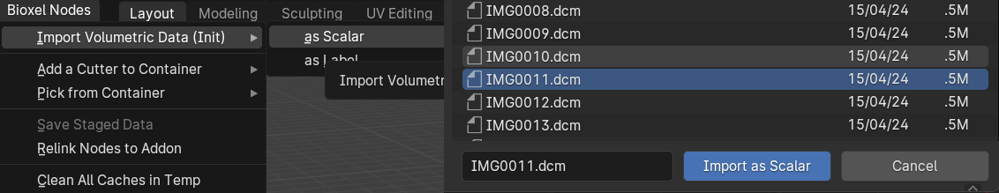
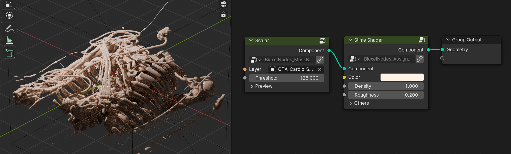
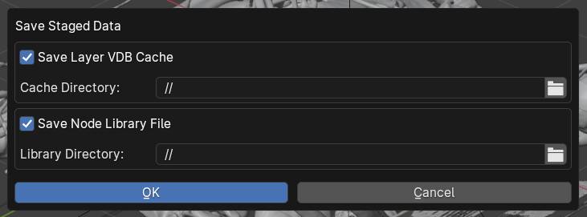
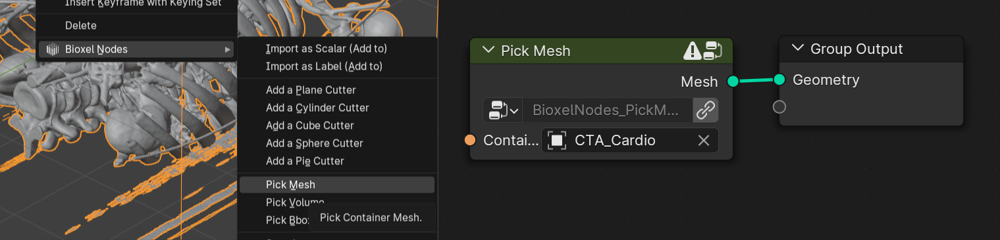

# Step by Step

## 1. Import Volumetric Data

**Bioxel Nodes > Import Volumetric Data (Init) > as Scalar**, select the data file, click on **Import as Scalar**. If the data is a sequence of files in directory, just pick **one** file in that directory, not the whole directory or multiple selection of files.

> you can also drag one of the data file directly into the 3D viewport to trigger the importing

It may take a while to read data. After finishing reading, it will pop up a dialog box. Ignore all the options, just click OK (we will talk about them later).

After the importing, the add-on will automatically add the necessary nodes to build the preview.

If there is nothing in the bbox wireframe, select the wireframe in 3D viewport, open the geometry nodes panel, set **Threshold** in the node lower to modify the preview.

## 2. Shading the Structure

The only node "Scalar" is responsible for mask out the unwanted area and generate the structure surface. You need to assign a shader to truly see the structure, connect a **Slime Shader** node (**Add > Bioxel Nodes > Shaders > Slime Shader**) after it. Turned on the cycles rendering to see the result.

You may change the **Color**, **Density** to modify the shader effect. All the parameters are straightforward, you can understand them by changing their values.

## 3. Cut to Cross-section

We often need to cut the structure to see the inside of the volumetric data. With Bioxel Nodes, it can be done by one click: select the structure in 3D viewport, right click, **Bioxel Nodes > Add a Plane Cutter**
. The add-on will add a cut node and a cutter object node to the node graph, which are responsible for the cutting process.

> Change the shader from **Slime** to **Universal** to render the cross-section. But it will increase rendering time

## 4. Save Staged Data (Optional)

The VDB cache and the custom nodes are not reachable to other computers if you don't save them. Those staged data should be saved, If you want to give your blender file to someone else, or you want to archive your blender file.

Save your blender file, then just click **Bioxel Nodes > Save Staged Data**

Just click **OK**, after that, both the VDB cache and the custom nodes are restored in relative locations. When you share this file with someone, pack the entire directory so that the resources will be not lost. The other person will be able to open it correctly, regardless of whether they have Bioxel Nodes installed or not.

## 5. Convert to Editable Mesh (Optional)

If you want digital sculpting, 3D printing, exporting to game engine, you should convert to editable mesh first.

Select the wireframe in 3D viewport, right click **Bioxel Nodes > Pick Mesh**.

It will create a new object with geometry nodes to refer the mesh. You can apply the geometry node to break the connection.
