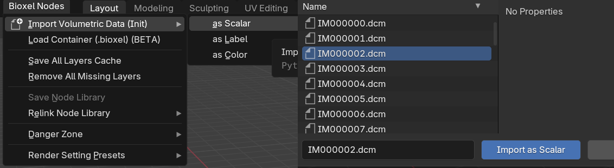
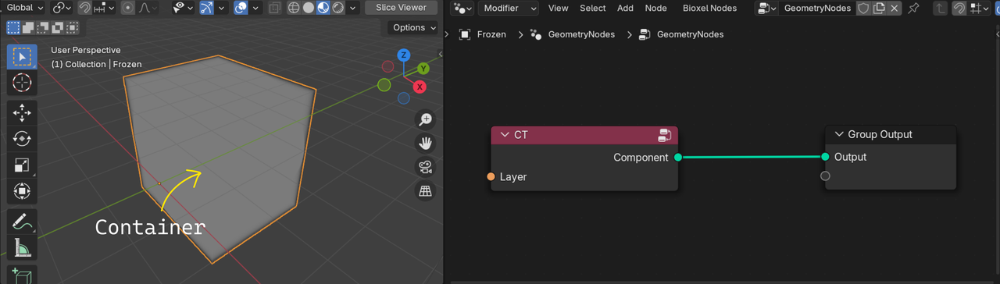
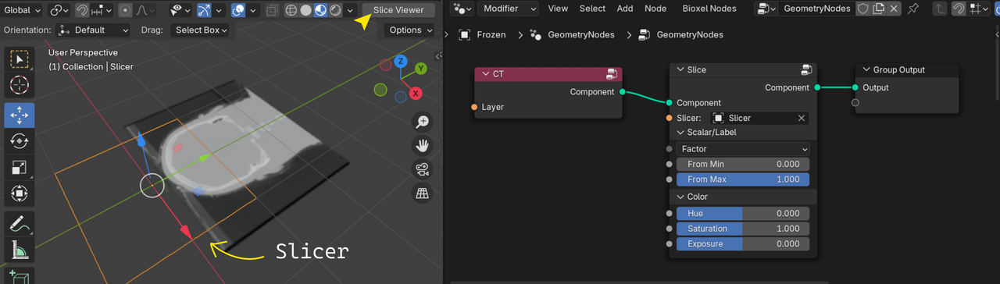
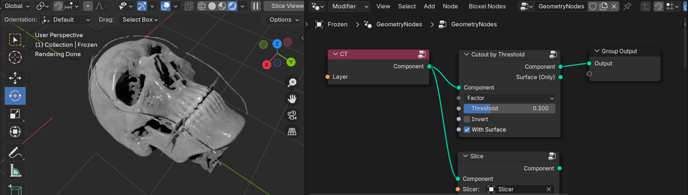
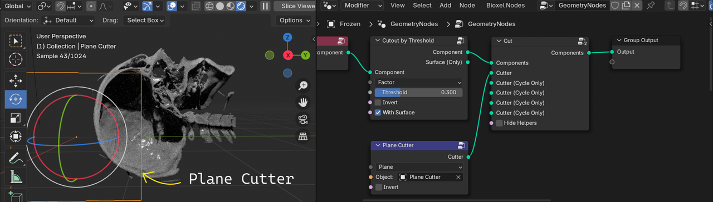
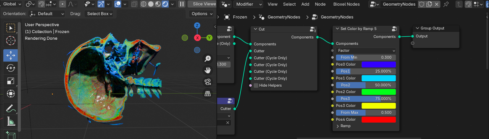
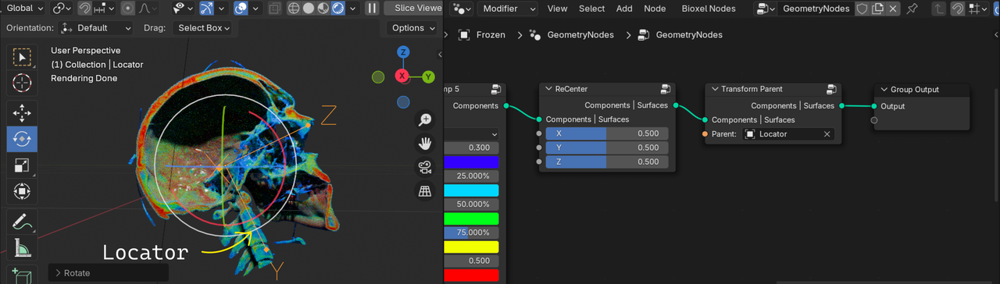
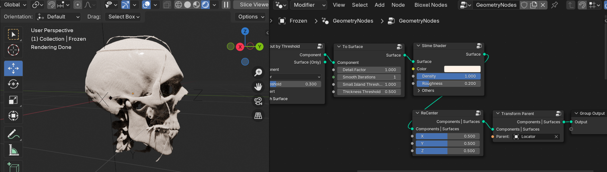
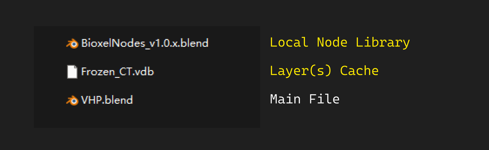

# 分步指南

## 下载数据

这里提供来自 [Visible Human Project (VHP)](https://www.nlm.nih.gov/research/visible/visible_human.html) 的公开数据供您学习插件使用。这是一个男性头部的 CT 扫描图像，下载并解压到新文件夹中备用。

[VHP_M_CT_Head.zip](https://drive.google.com/file/d/1bBGpt5pQ0evr-0-f4KDNRnKPoUYj2bJ-/view?usp=drive_link)

VHP 原始影像数据以 DICOM 前身专有格式共享，使用较为复杂。现在所有数据已统一为标准 DICOM 格式并发布在 [NCI Imaging Data Commons (IDC)](https://portal.imaging.datacommons.cancer.gov/) 上，您也可以自行从 IDC 下载数据。

## 导入数据

点击顶部菜单 **Bioxel Nodes > Import Volumetric Data (Init) > as Scalar**，定位到解压后的文件夹，选择任意一个 DICOM 文件（不要选择多个，也不要选择文件夹），然后点击 **Import as Scalar**。

您也可以通过将一个 DICOM 文件拖入 3D 视图来导入数据（部分 DICOM 文件没有扩展名，无法拖入）。

读取数据可能需要一段时间，Blender 界面右下角会显示读取进度，读取成功后会弹出一个对话框。目前先忽略所有选项，直接点击确定，稍后我会解释这些选项的作用。

导入过程涉及数据转换，因此需要等待更长时间，导入进度会显示在界面右下角。导入完成后，插件会创建一个新对象，其中包含一个新的几何节点，用于操作数据。这个新对象称为 **Container（容器）**。导入的数据作为 **Layer（图层）** 存储在容器中，通过 "Fetch Layer" 节点（红色）加载到容器的几何节点中，并转换为可渲染的 **Component（组件）**。

接下来，让我们在 Blender 中预览数据。

在容器的几何节点面板菜单中，点击 **Bioxel Nodes > Add a Slicer**。插件会插入一个名为 "Slice" 的节点，并创建一个新的平面对象 "Slicer"。点击 3D 视图右上角的 "Slice Viewer" 按钮进入预览模式，然后移动和旋转 "Slicer" 对象。您将看到数据的切片图像，任何使用过 DICOM 查看软件的人都会对此很熟悉。

（如果点击 "Slice Viewer" 按钮后体积消失，保存文件并重启 Blender 即可修复。您也可以打开 Cycles 渲染器来查看切片平面。这是因为 EEVEE 未能重新加载着色器导致的。）

"Slicer" 节点用于显示数据的切片，切片平面的位置由外部对象控制。这一步对于可视化并非必须，但它提供了一种在 Blender 中快速预览数据的方式。接下来，让我们将体数据转换为可渲染的对象。

## 提取颅骨

骨骼的 CT 值通常比软组织高得多，因此可以通过设置阈值来分离骨骼和软组织。在容器的几何节点面板菜单中，点击 **Add > Bioxel Nodes > Component > Cutout by Threshold** 添加一个 "Cutout" 节点，并将其连接在 "Fetch Layer" 节点和 "Output" 之间。然后将 "Cutout by Threshold" 节点的 "Threshold" 参数设置为 0.3，并打开 "With Surface" 选项。切换视图着色为 "Render Preview"。节点图和渲染结果如下图所示。

如果希望渲染结果与上图一致，还需要将默认灯光类型从 "Point" 改为 "Area" 以提高亮度，并将颜色管理中的 Look 改为 "High Contrast"。

您可以通过改变 "Threshold" 参数来理解它在塑造输出中的作用。如果您拖动参数时感到非常卡顿，可以暂时关闭 "Cutout" 节点中的 "With Surface" 选项。满意后再重新打开。此外，体渲染计算量很大，这也是导致卡顿的主要原因，因此建议先在 "Slice Viewer" 模式下调整参数，满意后再进行 Cycles 渲染。

您可能考虑使用 GPU 来加快渲染速度，但请注意，由于 Bioxel Nodes 依赖 OSL（Open Shader Language），目前仅支持 Optix GPU。初次开启 GPU 渲染时，可能需要等待 Blender 加载相应的依赖项（屏幕会卡住），请耐心等待。

虽然输出的组件看起来像网格对象，但它通过体数据保留了内部信息，因此当您切开组件时，会看到由体数据组成的不均匀截面，而不是像任何网格对象那样的空壳。让我们切开颅骨来观察其复杂的内部结构。

## 切割和着色

在容器的几何节点面板菜单中，点击 **Bioxel Nodes > Add a Cutter > Plane Cutter**，插件会插入一个 "Cut" 节点和一个 "Object Cutter" 节点。同时，它会创建一个新的平面对象 "Plane Cutter" 到场景中，此时您应该能看到颅骨已被切开。

与 "Slicer" 对象类似，移动和旋转 "Plane Cutter" 会改变切割的位置和方向。请将 Cutter 对象调整为垂直方向，使其垂直切开颅骨，如下图所示。

颅骨的 CT 值不均匀，这反映了骨质密度的差异。我们可以通过着色来增强这种差异的显示。在容器的几何节点面板菜单中，点击 **Add > Bioxel Nodes > Property > Set Color by Ramp 5** 添加 "Set Color" 节点，并连接在任何节点之后。将节点的 "From Min" 设置为 0.3，"From Max" 设置为 0.5，如下图所示。

开启渲染后，您可以清楚地看到顶骨和牙齿被染成红色，这意味着这些区域的骨骼密度更高。您可以尝试调整 "Set Color" 节点的参数来了解它们的作用。如果您拖动参数时感到卡顿，可以暂时关闭 "With Surface" 并切换到 "Slice Viewer" 模式。

## 变换

您可能会发现颅骨的位置有些偏离原点，这是因为插件在导入过程中保留了原始数据记录的位置信息。如果需要更改位置，请不要直接在 3D 视图中移动容器（如平常操作 3D 对象那样）；插件提供了专门的 "Transform" 节点来处理变换。

在容器的几何节点面板菜单中，点击 **Bioxel Nodes > Add a Locator**，插件会插入 "Transform Parent" 节点并创建一个新的空对象 "Locator"。如果您移动、旋转或缩放 "Locator"，颅骨也会随之变换。如果您希望旋转变换的原点设置在颅骨的几何中心，只需在 "Transform Parent" 节点之前添加一个 "ReCenter" 节点（Add > Bioxel Nodes > Transform > ReCenter），如下图所示。

习惯了直接在 3D 视图中移动对象，您可能会觉得多一步来变换组件有些奇怪。这样做是考虑到一个容器中可能涉及多个组件，它们有不同的变换需求，以及未来重采样机制的开发计划，我稍后会详细说明。

## 表面网格

由顶点和面组成的网格是 3D 世界中的"最大公约数"。因此，为了与其他 3D 工作流程兼容，插件提供了 "To Surface" 节点（Add > Bioxel Nodes > Component > ToSurface），它将组件转换为网格。请注意，表面网格在容器的几何节点中不可编辑，只能连接到 "Transform" 和 "Shader" 节点。

如下图所示，您可以连接 "Slime Shader" 节点（Add > Bioxel Nodes > Surface > Slime Shader）在 "To Surface" 节点之后，为表面赋予着色器，也可以连接 "Transform" 节点。

如果您想编辑网格，在容器的几何节点面板菜单中，点击 **Bioxel Nodes > Extract from Container > Extract Mesh**，插件会创建一个以容器名称为前缀的新网格模型对象，然后您可以执行常规的 3D 操作，如数字雕刻、动画、导出为 3D 打印格式 stl 等。

## 交付 Blender 文件

图层缓存存储在临时文件夹中，插件的自定义节点链接到插件目录中的节点库文件。两者默认都存在于本地，如果您只将 Blender 文件交付给其他设备，文件将无法正常工作，因为资源缺失。

因此，在交付 Blender 文件之前，您需要保存所有临时文件。步骤如下：

1. 保存 Blender 文件
2. 点击顶部菜单 **Bioxel Nodes > Save Node Library**，设置相对路径
3. 点击顶部菜单 **Bioxel Nodes > Save All Layers Cache**，设置相对路径

将 Blender 文件与本地节点库文件和图层缓存文件（可能不止一个）一起打包。

如果您能按照文档走到这一步，您已经入门了！